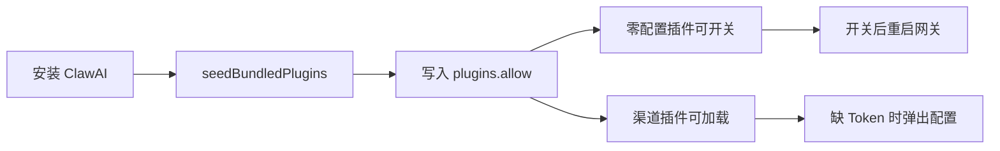

# 让别人电脑也能用上内置插件

## 结论（先说清边界）

- **能做成装完即用**：双模型教学、DuckDuckGo（若 OpenClaw 自带）、Webhooks、任务看板、Bonjour、自动摘要（纠正 UI 映射）、以及我们已 seed 的 ClawAI 插件。
- **做不到免账号**：Slack / Matrix 永远需要对方平台 Token；Codex 需要本机已装 Codex。这两类目标是「代码在、开关有效、缺什么一眼看出、点一下能填完」。

默认按：**零配置开箱 + 渠道类就绪向导**（不做完整 OAuth）。

## 根因（别人电脑上挂的原因）

1. UI 固定展示 [renderer.js](renderer.js) 里 `pluginMetadata` 的 9 张卡，但真正随包部署的只有 [main.js](main.js) `BUNDLED_CUSTOM_PLUGINS`（双模型等自研插件）。
2. 开关只改 `enabled`；若 id 未进 `plugins.allow` / 未部署到 `~/.openclaw/extensions`，网关仍不加载。
3. UI 把「自动摘要」绑成 `llm-task`，忽略自研 `auto-summary`，命名与真实能力错位。
4. Slack/Matrix 依赖历史里 `~/.openclaw/npm/projects/...` 缓存，新机没有这些目录就不会装。

## 实施方案

### 1. 分类与默认策略（config + seed）

在 [main.js](main.js) / [config/openclaw.json.example](config/openclaw.json.example) 建立三类清单：

| 类型 | 插件 | 行为 |
|------|------|------|
| A 零配置 | `dual-model-trainer`, `duckduckgo`, `webhooks`, `workboard`, `bonjour`, `llm-task`, `auto-summary` | 确保 `entries` 存在；默认 `duckduckgo`+`dual-model` 可开，其余默认关但 **永久进 allow**；网关能发现即生效 |
| B 需凭证 | `slack`, `matrix` | 代码探活；默认关；开时若缺配置弹向导，不静默失败 |
| C 需本机软件 | `auto-start-codex` | 检测 Codex 可执行文件；没有则禁用开并提示 |

启动时（现有 `config-read` / `seedBundledPlugins` 路径）保证：

- A/B 全部写入 `plugins.allow`
- A 中「推荐默认开」的在新机首次 stamp 时打开（与现有 version stamp 同套路）
- 自研插件继续 `seedBundledPlugins()` 复制到 `CONFIG_DIR/extensions`

### 2. 零配置插件：确保「开关 = 真加载」

改 [renderer.js](renderer.js) `renderPluginsGrid` 开关逻辑：

- `enabled=true` 时同步 `plugins.allow.push(id)`（main 侧已有类似逻辑，前端开关也要对齐，避免漏写）
- 纠正元数据：`自动摘要` 改为真实绑定 `auto-summary`（或卡片同时展示两者、主推自研每日总结；**选定：主卡片改为 `auto-summary`，副说明保留可开 `llm-task` 做链接/长文摘要**——实现上用一张卡映射 `auto-summary`，并把 `llm-task` 并入 allow 作为能力补充，避免两张重复卡）

改 [main.js](main.js)：

- 扩展 `BUNDLED_UI_PLUGINS`（或 rename）覆盖 UI 九项 id，启动时 ensure entries + allow
- 探测 OpenClaw 内置插件是否存在（`node_modules/openclaw` 下 extensions / plugins 目录）；若不存在 `duckduckgo`，卡片标记「当前运行时未内置」而不是假装可用
- 开关后已有重启逻辑保留

### 3. Slack / Matrix：一键就绪 + 配置向导

主进程新增轻量 API（preload 暴露）：

- `plugin-probe`: 返回 `{ available, needsConfig, missingFields, hint }`
- `plugin-save-credentials`: 写入 `openclaw.json` 渠道必要字段（Slack bot token / Matrix homeserver+token 的最小集）

开开关时：

1. probe
2. 缺配置 → dialog / 简单 modal 填 Token
3. 写入 + 进 allow + 重启网关
4. 若包缺失 → 尝试 `openclaw plugins install <id>` 或提示「需网络从 OpenClaw 拉取一次」（打包机无法预装所有私有 npm 缓存时，用首次开启联网安装）

**不做**：全自动登录对方平台；用户仍需自行在 Slack/Matrix 后台建应用复制 Token。

### 4. Codex：本机探测

- Windows 常见路径 / `Get-Command` 探测 Codex
- 未安装：卡片显示「需安装 Codex」，开关无法有效开启并 toast 说明
- 已安装：写 `hooks.internal.entries['auto-start-codex'].enabled`

### 5. 插件页 UX（让别人看得懂）

在 [renderer.js](renderer.js) / [index.html](index.html) / [locales.js](locales.js) 每张卡增加状态徽章：

- `开箱可用` / `需配置` / `需安装软件` / `本机运行时缺失`
- 副文案一行：例如「需 Slack Bot Token」「需本机 Codex」

避免再出现「开关紫了但别人电脑啥也没有」的错觉。

### 6. 验收

- 干净机（或清 `plugins.allow` + 重装仿真）：开 DuckDuckGo / Webhooks / 看板 → 网关日志出现对应 plugin id
- 双模型：extensions 目录有文件且日志有 `[dual-model-trainer]`
- Slack：无 Token 开开关 → 弹出向导而非空转；填假 Token 后至少进入加载路径
- Codex 未装 → 明确提示

## 关键改动文件

- [main.js](main.js) — allow/seed/probe/credential IPC、Codex 探测
- [preload.js](preload.js) — 暴露新 API
- [renderer.js](renderer.js) — 卡片徽章、开关流程、自动摘要映射纠正
- [locales.js](locales.js) — 状态文案
- [config/openclaw.json.example](config/openclaw.json.example) — 默认 allow 与 entries 对齐
- 可选小测：`scripts/test-plugin-catalog.js` 断言三类清单与 allow 合并逻辑

## 明确不做

- 替用户注册 Slack/Matrix 应用
- 把完整 `@openclaw/slack` npm 工程塞进安装包（体积大且版本易碎）；改为 allow + 首次开启时安装/探活
- 默认把所有渠道插件打开（吵、慢、易报错）
