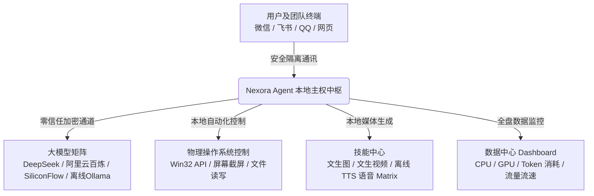
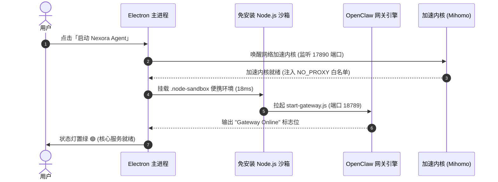
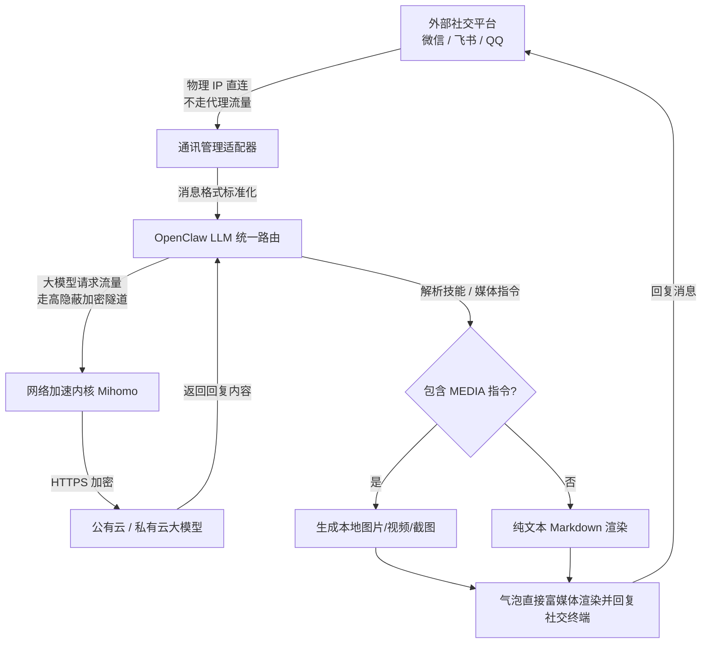
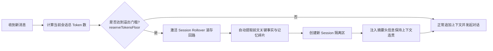
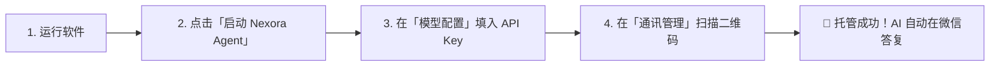

<div align="center">

<br />

<!-- ⚡ 100% 兼容无乱码·流光动态赛博 Header ⚡ -->


<br />
<br />

<p align="center">
  
</p>

### 🌌 Autonomous, Self-Healing & Distributed Local AI Intelligence Matrix

**贯通大模型生态与全渠道社交终端的零信任本地主权 AI 自动化中枢**

*Engineered for Absolute Privacy. Powered by Local Intelligence. Driven by Zero-Trust Architecture.*

<br />

[](https://github.com/2014-y/NexoraAgent)
[](https://github.com/2014-y/NexoraAgent)
[](https://github.com/2014-y/NexoraAgent)
[](https://github.com/2014-y/NexoraAgent)
[](https://github.com/2014-y/NexoraAgent)
[](LICENSE)

<br />

[💡 系统用途与应用场景](#-系统用途与全场景应用框架) •
[🖥️ 菜单面板功能全解析](#-界面菜单与功能模块全解析) •
[🔄 系统运行全流程与机制](#-系统全链路运行流程与架构图解) •
[⚙️ 全套配置与部署指南](#-全套部署配置与快速上手指南) •
[🏛️ 四层主权架构白皮书](#-四层系统架构白皮书-four-tier-enterprise-architecture) •
[🛠️ 自愈诊断与故障排查](#-故障诊断与自愈排查手册)

</div>

---

```text
   ███╗   ██╗███████╗██╗  ██╗██████╗ ██████╗  █████╗      █████╗  ██████╗ ███████╗██╗  ██╗████████╗
   ████╗  ██║██╔════╝╚██╗██╔╝██╔══██╗██╔══██╗██╔══██╗    ██╔══██╗██╔════╝ ██╔════╝██║  ██║╚══██╔══╝
   ██╔██╗ ██║█████╗   ╚███╔╝ ██████╔╝██████╔╝███████║    ███████║██║  ███╗█████╗  ███████║   ██║   
   ██║╚██╗██║██╔══╝   ██╔██╗ ██╔══██╗██╔══██╗██╔══██║    ██╔══██║██║   ██║██╔══╝  ██╔══██║   ██║   
   ██║ ╚████║███████╗██╔╝ ██╗██║  ██║██║  ██║██║  ██║    ██║  ██║╚██████╔╝███████╗██║  ██║   ██║   
   ╚═╝  ╚═══╝╚══════╝╚═╝  ╚═╝╚═╝  ╚═╝╚═╝  ╚═╝╚═╝  ╚═╝    ╚═╝  ╚═╝ ╚═════╝ ╚══════╝╚═╝  ╚═╝   ╚═╝   
```

---

## 🖥️ 极客拟态终端实时视界 (Cyberpunk Interactive Live Matrix)

```text
 ┌─────────────────────────────────────────────────────────────────────────────────────────────┐
 │ NEXORA AGENT KERNEL TELEMETRY (SOVEREIGN ENGINE LIVE BOOT STREAM)                           │
 ├─────────────────────────────────────────────────────────────────────────────────────────────┤
 │ [SYSTEM]    Bootstrapping Nexora Agent Core Engine...                          [SUCCESS]    │
 │ [SANDBOX]   Attached Portable Node.js LTS Hardened Environment                 (18ms)       │
 │ [SECURITY]  Applied NO_PROXY Domain Identities. Zero-Trust Shield Active.      [SECURE]     │
 │ [ROUTER]    Omni-Channel Connectors Loaded: WeChat, Feishu, QQBot, Slack, Matrix            │
 │ [RECONNECT] Exponential Backoff Circuit Breaker Primed. Auto-Retry Floor: Infinity          │
 │ [MEMORY]    Incremental Long-Term Memory Synced (~/.openclaw/MEMORY.md). Deduplicated.      │
 │ [ROLLOVER]  Session Overflow Rollover Circuit Armed. Auto-Compaction Ready.                 │
 │ [SKILLS]    Loaded Native Skill Plugins: Image Generator, Video Generator, Desktop Control   │
 │ [METRICS]   Data Center Telemetry Service Initialized on Local IPC Pipeline.                 │
 │ [GATEWAY]   Gateway Online at http://127.0.0.1:18789. All Systems Operational               │
 └─────────────────────────────────────────────────────────────────────────────────────────────┘
```

---

## 💡 系统用途与全场景应用框架

**Nexora Agent** 是一款面向个人智囊、企业私域与自动化运维的 **零信任本地主权 AI 自动化中枢**。它将各大公有云/私有化大模型的认知能力与微信、飞书、QQ、钉钉等全渠道社交终端及物理操作系统无缝无痕无感连接。


```mermaid
graph TD
    A[用户及团队终端<br/>微信 / 飞书 / QQ / 网页] -->|安全隔离通讯| B(Nexora Agent 本地主权中枢)
    B -->|零信任加密通道| C[大模型矩阵<br/>DeepSeek / 阿里云百炼 / SiliconFlow / 离线Ollama]
    B -->|本地自动化控制| D[物理操作系统控制<br/>Win32 API / 屏幕截屏 / 文件读写]
    B -->|本地媒体生成| E[技能中心<br/>文生图 / 文生视频 / 离线 TTS 语音 Matrix]
    B -->|全盘数据监控| F[数据中心 Dashboard<br/>CPU / GPU / Token 消耗 / 流量流速]
```

### 1. 全渠道个人 AI 数字分身
* **微信 / 飞书 / QQ 消息自动托管**：手机不在身旁或工作繁忙时，助手可在后台实时接管特定好友或群聊，使用带有您个人专属记忆的语气与知识库准确回复。
* **增量长期记忆萃取**：自动从对话中提取您的工作偏好、习惯与既定日程，保存至本地纯文本 Markdown 库，越用越懂得您的需求。

### 2. 企业级私域流量与客服自动化
* **全双工智能客服**：无需昂贵的 SaaS 系统，在本地电脑即可拉起 7×24 小时微信/飞书客服机器人，支持多图发送、文档解析与智能故障排除。
* **防封号双路路由**：社交平台通信数据包纯本地 IP 直连，大模型 API 走加密隧道，技术层面规避风控封号风险。

### 3. 极客与开发者 RPA 桌面自动化
* **物理桌面控制**：AI 可直接分析当前屏幕内容，利用原生的 `user32.dll` 驱动模拟物理鼠标点击与键盘敲击，自动完成表单填写、软件测试与数据抓取。
* **离线安全沙箱**：基于隔离免安装 Node.js LTS 环境，即使执行复杂 Python/Shell 脚本，也不会影响宿主机的真实操作系统环境。

### 4. 离线高保密智囊与多媒体创作
* **零数据外泄**：所有聊天历史、凭证与记忆数据库 100% 存储于本地磁盘，零数据上传第三方中间件。
* **原生音视频创作**：集成离线 Sherpa-Onnx 神经网络语音合成、文生图与文生视频插件，气泡内直接预览与播放生成的多媒体文件。

---

## ⚡ 核心能力网格 (Core Capability Grid)

<table width="100%">
<tr>
<td width="33%" valign="top">
<h3>🛡️ 零信任物理隔离</h3>
<b>Zero-Trust Physical Isolation</b>
<p>所有的聊天日志、通讯凭证与记忆切片 100% 存放在本机磁盘，不经过任何第三方中间件。私密数据绝对不出本机。</p>
</td>
<td width="33%" valign="top">
<h3>⚡ 无限退避自动重连</h3>
<b>High-Availability Circuit Breaker</b>
<p>独创 v3 智能心跳监测算法。遇到局域网闪断或路由重启，自动开启指数退避静默热重连，45 秒内自适应恢复上线。</p>
</td>
<td width="33%" valign="top">
<h3>🌐 智能双路防封路由</h3>
<b>Anti-Anti-Agent Gateway</b>
<p>独创域名安全白名单分流。微信、飞书、QQ 官方心跳 100% 本地物理 IP 直连，大模型走代理加密，技术层面彻底防风控封号。</p>
</td>
</tr>
<tr>
<td width="33%" valign="top">
<h3>🧠 增量长期记忆中枢</h3>
<b>Markdown Long-Term Memory</b>
<p>内置记忆自动提取与去重引擎。将用户的偏好与设定增量沉淀至本地 Markdown 库，跨会话自动注入 Prompt，打造越用越聪明的专属 AI 人格。</p>
</td>
<td width="33%" valign="top">
<h3>🗣️ 全离线神经网络语音</h3>
<b>Offline Neural Voice Matrix</b>
<p>集成 VAD 静音滑窗判定算法与 VITS 神经网络中英混合语音推理，配合 Windows SAPI COM 降级兜底，零网络依赖朗读。</p>
</td>
<td width="33%" valign="top">
<h3>🖥️ 物理级 Win32 桌面控制</h3>
<b>Win32 Synthetic Actuator</b>
<p>穿透 DPI 动态缩放，调用 user32.dll 物理事件驱动。大模型可如真人般操控 Windows 桌面，完成截图、点击与按键自动化。</p>
</td>
</tr>
<tr>
<td width="33%" valign="top">
<h3>🔄 超长会话无缝滚存</h3>
<b>Session Overflow Rollover</b>
<p>突破 Token 长度限制。当会话超出上下文阈值时，自动提取关键摘要并滚存至新会话，保持长期对话连续不中断。</p>
</td>
<td width="33%" valign="top">
<h3>🛠️ 技能扩展中枢</h3>
<b>Native Skill Center</b>
<p>提供生图、生视频、抓屏与网络诊断等多维技能插件，支持热加载与灵活调度，大幅扩展大模型的能力边界。</p>
</td>
<td width="33%" valign="top">
<h3>📊 数据中心仪表盘</h3>
<b>Data Center Telemetry</b>
<p>提供全盘可视化监控，实时图表展示 CPU/内存/网络吞吐量及 Token 消耗动态，系统健康度一清二楚。</p>
</td>
</tr>
</table>

---

## 🖥️ 界面菜单与功能模块全解析

Nexora Agent 采用了极简现代的赛博暗黑风 UI 设计，导航栏位于软件左侧，各功能模块分工清晰，便于一站式管理：

```text
 ┌───────────────────┬────────────────────────────────────────────────────────────────────────┐
 │ Nexora Agent      │ 🟢 核心服务就绪 | 端口: 18789  [ 终止服务 ] [ 重启网关 ]                   │
 ├───────────────────┼────────────────────────────────────────────────────────────────────────┤
 │ 💬 模型会话       │  ┌───────────────────────────────┐ ┌──────────────────────────────────┐  │
 │ 🧠 模型配置       │  │ 会话列表 (Rollover 自动支持)  │ │ 当前对话气泡视界                 │  │
 │ 📱 通讯管理       │  │ - 默认微信对话                │ │ [AI] 你好！我是您的本地主权AI助手│  │
 │ 🛠️ 技能中心       │  │ - 工作助理                    │ │ [MEDIA] 渲染本地生成的图片/视频   │  │
 │ 📊 数据中心       │  └───────────────────────────────┘ └──────────────────────────────────┘  │
 │ 🎙️ 语音配置       │  模型选择: [ agnes-ai/agnes-2.0-flash ▼ ]   [ 探针测试 ] [ 清空会话 ]    │
 │ ⚙️ 系统设置       │                                                                        │
 └───────────────────┴────────────────────────────────────────────────────────────────────────┘
```

### 1. 顶部控制栏 (Top Control Matrix)
* **状态指示灯**：
  * 🔴 **红色**：核心服务已停止，无法处理消息与请求。
  * 🟡 **黄色**：系统正在拉起 Node.js 本地沙箱与网络加速内核。
  * 🟢 **绿色**：**核心服务就绪！** 表示网关服务已成功在本地端口（默认 `18789`）开启监听，随时响应连接。
* **启动 / 终止服务按键**：一键切换网关与沙箱的启动与停止。
* **重启网关 / 重置按键**：遇到异常网络波动或需要生效新插件时，可在此强行重启网关。

### 2. 💬 模型会话 (Chat & Interactive Sessions)
* **主对话窗口**：支持 Markdown 渲染、代码高亮一键复制、LaTeX 公式展示及本地媒体文件（图片、视频、音频）直显。
* **模型快速切换下拉框**：实时显示当前可用的云端与本地大模型，随时无缝切换。
* **会话无缝滚存 (Session Overflow Rollover)**：当单个会话累积的 Token 接近模型上限时，滚存引擎将自动总结上文历史并创建新会话，对话流畅不断层。
* **快捷会话管理**：支持新建会话、删除历史会话、一键清空上下文以及会话搜索。

### 3. 🧠 模型配置 (Model Provider Matrix)
* **供应商统一管理**：预置并支持接入 `agnes-ai`、`DeepSeek`、`阿里云百炼 (Qwen)`、`SiliconFlow (硅基流动)`、`OpenAI`、`Ollama` 等国内外主流大模型厂商。
* **API Key 安全存储**：填入的凭证 100% 使用本地加密字典落盘，绝不出本机。
* **识图/视觉模型对齐 (Vision Model Alignment)**：自动识别带有图像理解能力的模型（如 `vision` / `multimodal`），确保图像输入时自动匹配多模态解析通道。
* **模型连通性探针**：点击「测试连接」，系统自动向指定 API 发送探针数据包，反馈延迟毫秒数与服务可用性。

### 4. 📱 通讯管理 (Channel Manager)
* **全渠道卡片矩阵**：
  * **微信 (WeChat)**：支持网页/iPad 协议扫码登录，内嵌 v3 指数退避重连算法。
  * **飞书 (Feishu)**：支持企业自建应用 App ID 与 App Secret 绑定，支持群聊与私聊托管。
  * **QQBot**：官方机器人 API 接入，自动过滤指令与消息响应。
  * **Slack / Matrix / Voice Call**：全双工扩展适配。
* **二维码弹窗交互**：点击「扫码绑定」，自动生成高清晰 Base64 二维码，手机扫描即可完成秒级托管。

### 5. 🛠️ 技能中心 (Skill Center)
* **内置技能生态**：
  * 📷 **桌面抓屏 (Screen Capture)**：调用高清截屏工具截取当前屏幕，自动传给视觉大模型分析。
  * 🖱️ **物理桌面操控 (Desktop Control)**：支持用户模拟点击、输入、快捷键组合等物理级 Windows RPA 操作。
  * 🎨 **文生图插件 (Image Generator)**：通过自然语言提示词直接生成高清图片并直接呈现在聊天气泡中。
  * 🎬 **文生视频插件 (Video Generator)**：输入画面描述生成动态视频片段。
* **技能热加载与开关**：开发者可随时启用或禁用特定技能，灵活控制 AI 的操作权限。

### 6. 📊 数据中心 (Data Center Dashboard)
* **可视化 Telemetry 仪表盘**：
  * **CPU & 内存占用率**：实时监控本地沙箱与网关占用的资源比例。
  * **网络吞吐量 (Network I/O)**：展示实时上行与下行流量速率曲线。
  * **Token 消耗与分布曲线**：直观统计输入 Token、输出 Token 及累计消耗量。
  * **请求响应延迟分布**：记录大模型调用的首字延迟（TTFT）与平均响应耗时。

### 7. 🎙️ 语音配置 (Offline Voice Matrix)
* **离线语音推理引擎**：基于 Sherpa-Onnx 神经网络，实现中英混合高质量 TTS 文本转语音。
* **VAD 人声滑动窗口**：通过滑动窗口算法判定用户说话的起始与静音停顿，实现连续语音对话。
* **Windows SAPI 降级兜底**：当缺少神经网络模型权重时，系统自动无缝降级至 Windows 本地 SAPI 音频合成，确保 100% 可发出声音。

### 8. ⚙️ 系统设置与自愈诊断 (Settings & Diagnostics)
* **内核网络加速 (Mihomo Core)**：可选开启内置代理内核，为云端大模型 API 提供稳定加速。
* **白名单配置 (NO_PROXY)**：管理不经过代理的本地与社交平台域名白名单。
* **系统完整性探针 (Doctor Probe)**：一键诊断系统依赖、端口占用、权限策略与配置文件完整性。
* **日志视界 (Log Telemetry Window)**：实时流式输出系统 stdout/stderr 日志，便于高级用户排查疑难问题。

---

## 🔄 系统全链路运行流程与架构图解

### 1. 软件启动与沙箱挂载流程

```mermaid
sequenceDiagram
    autonumber
    actor User as 用户
    participant Main as Electron 主进程
    participant Sandbox as 免安装 Node.js 沙箱
    participant Gateway as OpenClaw 网关引擎
    participant Proxy as 加速内核 (Mihomo)

    User->>Main: 点击「启动 Nexora Agent」
    Main->>Proxy: 唤醒网络加速内核 (监听 17890 端口)
    Proxy-->>Main: 加速内核就绪 (注入 NO_PROXY 白名单)
    Main->>Sandbox: 挂载 .node-sandbox 便携环境 (18ms)
    Sandbox->>Gateway: 拉起 start-gateway.js (端口 18789)
    Gateway-->>Main: 输出 "Gateway Online" 标志位
    Main->>User: 状态灯置绿 🟢 (核心服务就绪)
```

### 2. 多渠道消息收发与防封分流流程

```mermaid
flowchart TD
    A[外部社交平台<br/>微信 / 飞书 / QQ] -->|物理 IP 直连<br/>不走代理流量| B[通讯管理适配器]
    B -->|消息格式标准化| C[OpenClaw LLM 统一路由]
    C -->|大模型请求流量<br/>走高隐蔽加密隧道| D[网络加速内核 Mihomo]
    D -->|HTTPS 加密| E[公有云 / 私有云大模型]
    E -->|返回回复内容| C
    C -->|解析技能 / 媒体指令| F{包含 MEDIA 指令?}
    F -- 是 --> G[生成本地图片/视频/截图]
    F -- 否 --> H[纯文本 Markdown 渲染]
    G --> I[气泡直接富媒体渲染并回复社交终端]
    H --> I
    I -->|回复消息| A
```

### 3. 上下文超长自动无缝滚存 (Session Overflow Rollover) 流程

```mermaid
flowchart LR
    A[收到新消息] --> B(计算当前会话总 Token 数)
    B --> C{是否达到溢出门槛?<br/>reserveTokensFloor}
    C -- 否 --> D[正常追加上下文并发起对话]
    C -- 是 --> E[激活 Session Rollover 滚存回路]
    E --> F[自动提取前文关键事实与记忆碎片]
    F --> G[创建新 Session 隔离区]
    G --> H[注入摘要头信息保持上下文连贯]
    H --> D
```

---

## ⚙️ 全套部署配置与快速上手指南

### 1. 极速安装与部署 (3 分钟上手)
1. **下载安装包**：在仓库 Releases 或官方发布渠道获取 `Nexora Agent Setup.exe` 安装文件。
2. **图形化安装**：双击运行安装向导，按照提示选择安装路径，软件会自动完成桌面快捷方式建立。
3. **零环境准备**：软件**内置全套免安装 Node.js 沙箱环境**，您的电脑无需预装任何 Node.js、Python 或 Git 环境即可直接运行。

### 2. 第一次配置与使用步骤

```mermaid
flowchart LR
    Step1[1. 运行软件] --> Step2[2. 点击「启动 Nexora Agent」]
    Step2 --> Step3[3. 在「模型配置」填入 API Key]
    Step3 --> Step4[4. 在「通讯管理」扫描二维码]
    Step4 --> Step5[🎉 托管成功！AI 自动在微信答复]
```

> [!TIP]
> **推荐模型配置**：若您初次使用，推荐选择 `DeepSeek` 或 `阿里云百炼 (Qwen)` 厂商，填入您申请到的 API Key，不仅响应速度极快，且具备优秀的推理与文本生成能力。

---

## 🏛️ 四层系统架构白皮书 (Four-Tier Enterprise Architecture)

Nexora Agent 采用了分层解耦的四层软件架构设计，保障了系统的极高可靠性与扩展性：

```text
+-----------------------------------------------------------------------------------+
| Layer 3: Omni-Channel Actuators & Interface (全双工适配与交互层)                   |
| - WeChat Connector / Feishu Connector / QQBot Connector / Slack Connector          |
| - Sherpa-Onnx Neural ASR & VITS TTS Offline Voice Gateway                         |
| - Inline Media Rich-Text Bubble Renderer & Data Center Telemetry                  |
+-----------------------------------------------------------------------------------+
                                   │ (JSON-RPC / WebSockets / IPC)
                                   ▼
+-----------------------------------------------------------------------------------+
| Layer 2: Cognitive Engine & Memory Matrix (认知智能与记忆中枢层)                 |
| - OpenClaw LLM Router & Unified OpenAI Protocol Translator                        |
| - Markdown-based Incremental Long-Term Memory Deduplicator (MEMORY.md)            |
| - Context Compaction & Token Salience Floor (reserveTokensFloor)                  |
| - Automatic Session Overflow Seamless Rollover Engine                             |
+-----------------------------------------------------------------------------------+
                                   │ (Loopback Proxy / Internal Mesh)
                                   ▼
+-----------------------------------------------------------------------------------+
| Layer 1: Protocol Proxy & Security Firewall (安全协议与防封路由层)                 |
| - Mihomo Core Agent (Local Port 17890)                                            |
| - NO_PROXY White-List Traffic Separator (*.weixin.qq.com / *.feishu.cn)           |
| - Automatic Crash-Loop Breaker Bypass & Override Handler                          |
+-----------------------------------------------------------------------------------+
                                   │ (Win32 System Calls & Native Addons)
                                   ▼
+-----------------------------------------------------------------------------------+
| Layer 0: Hardware, Runtime & OS Sandbox (物理硬件与系统沙箱层)                     |
| - Portable Node.js LTS Sandbox & node:sqlite Engine                               |
| - Win32 User32.dll Direct Input Driver (Synthetic Mouse/Keyboard Injection)       |
| - Multi-Monitor High-DPI Desktop Capture Engine                                   |
+-----------------------------------------------------------------------------------+
```

---

## 🛠️ 故障诊断与自愈排查手册

> [!NOTE]
> 常见的系统运行问题均可根据以下排查指南在数秒内完成自主修复：

<table width="100%">
<thead>
<tr>
<th align="left">故障现象</th>
<th align="left">底层诱发原因</th>
<th align="left">自愈排查解决方案</th>
</tr>
</thead>
<tbody>
<tr>
<td><b>通道提示 <code>crash-loop breaker tripped</code></b></td>
<td>多次强制杀死进程导致异常关机计数超限</td>
<td>最新系统已内置自愈。点击「终止服务」后再点击「启动」，主进程会自动擦除锁定标号。</td>
</tr>
<tr>
<td><b>微信连接成功但网络断开后不自动恢复</b></td>
<td>网络波动引发 WebSocket 物理连接断开</td>
<td>系统已内置 v3 高可用重连引擎，网络恢复后 45 秒内自动静默热重连，无需重新扫码。</td>
</tr>
<tr>
<td><b>语音网桥报错 <code>ECONNREFUSED 18791</code></b></td>
<td>语音服务未开启或 18791 端口被残留进程占用</td>
<td>进入「系统设置」 $\rightarrow$ 取消勾选「开启语音」 $\rightarrow$ 2 秒后重新勾选开启，强制强置端口。</td>
</tr>
<tr>
<td><b>加速内核提示 <code>17890</code> 端口冲突</b></td>
<td>本地运行了 v2rayN 或 Clash 等第三方软件占用端口</td>
<td>关闭第三方软件，或在设置面板中将 HTTP 加速端口修改为其他空闲端口（如 17898）。</td>
</tr>
<tr>
<td><b>扫码后提示二维码失效</b></td>
<td>二维码生成超时或手机确认时间过长</td>
<td>在「通讯管理」中点击「重新生成二维码」，掏出手机即刻扫描并点击确认。</td>
</tr>
</tbody>
</table>

---

## 👨‍💻 开发者二次开发与插件扩展

### 1. 本地构建与源码调试
```bash # 克隆项目代码仓库
git clone https://github.com/2014-y/NexoraAgent.git
cd NexoraAgent

# 安装本地依赖
npm install

# 启动 Electron 本地开发调试模式
npm run app:start

# 构建一键安装包 (NSIS Installer)
npm run app:dist
```

### 2. 编写自定义技能插件
在 `plugins/my-custom-skill/` 目录下创建 `index.js`：

```javascript
'use strict';

class CustomSkillPlugin {
  constructor(context) {
    this.ctx = context; // 注入系统主权上下文
  }

  async onload() {
    this.ctx.log?.info('[CustomSkill] 技能插件成功加载');
    // 注册自定义路由或工具监听
  }

  async onunload() {
    this.ctx.log?.info('[CustomSkill] 技能插件已卸载');
  }
}

module.exports = CustomSkillPlugin;
```

---

## 📄 许可证协议 (License)

本项目基于 **[MIT License](LICENSE)** 开源协议发布。您可以自由修改、商业化部署、二次开发或分发。

---

<div align="center">
  <b>Built with ❤️ by Nexora Team.</b><br />
  <i>Empowering Autonomous Local AI Agents everywhere.</i>
</div>
