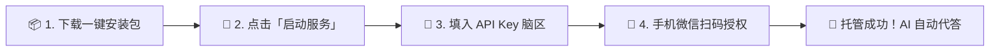
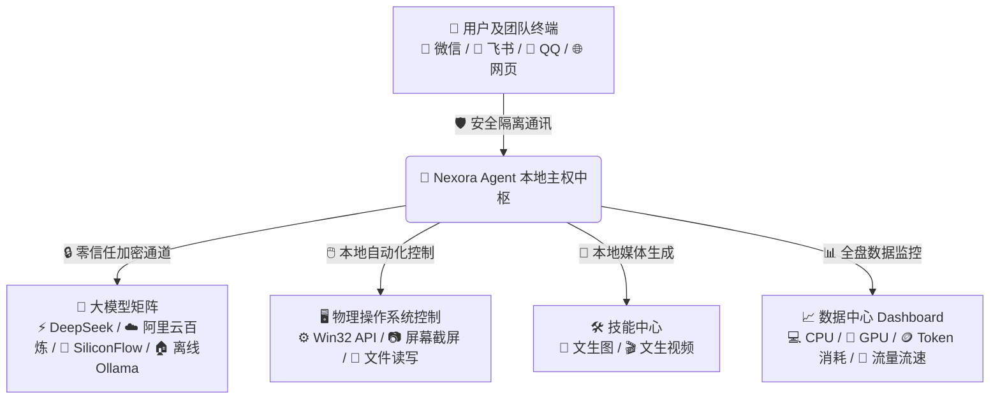
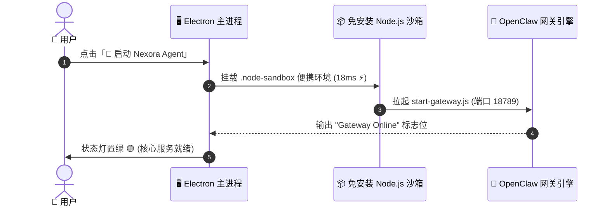
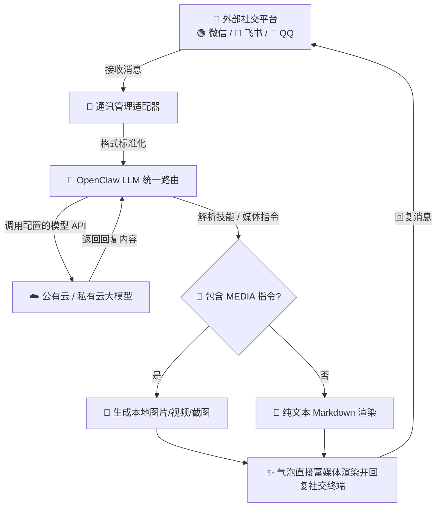
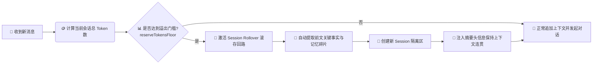

<div align="center">

<br />

<!-- ⚡ 100% 兼容无乱码·流光动态赛博 Header ⚡ -->


<br />
<br />

<p align="center">
  
</p>

### 🌌 Autonomous, Self-Healing & Distributed Local AI Intelligence Matrix

**✨ 贯通大模型生态与全渠道社交终端的零信任本地主权 AI 自动化中枢 ✨**

*Engineered for Absolute Privacy 🛡️. Powered by Local Intelligence 🧠. Driven by Zero-Trust Architecture 🔒.*

<br />

[](https://github.com/2014-y/NexoraAgent)
[](https://github.com/2014-y/NexoraAgent)
[](https://github.com/2014-y/NexoraAgent)
[](https://github.com/2014-y/NexoraAgent)
[](https://github.com/2014-y/NexoraAgent)
[](LICENSE)

<br />

[🐣 小白零门槛安装教程](#-小白零门槛一键安装与使用全指南-novice-guide) •
[💡 系统用途与应用场景](#-系统用途与全场景应用框架) •
[🖥️ 主要功能介绍](#-主要功能介绍) •
[🔄 系统运行全流程与机制](#-系统全链路运行流程与架构图解) •
[🏛️ 四层主权架构白皮书](#-四层系统架构白皮书-four-tier-enterprise-architecture) •
[🛠️ 自愈诊断与故障排查](#-故障诊断与自愈排查手册)

</div>

---

```text
   ███╗   ██╗███████╗██╗  ██╗██████╗ ██████╗  █████╗      █████╗  ██████╗ ███████╗██╗  ██╗████████╗
   ████╗  ██║██╔════╝╚██╗██╔╝██╔══██╗██╔══██╗██╔══██╗    ██╔══██╗██╔════╝ ██╔════╝██║  ██║╚══██╔══╝
   ██╔██╗ ██║█████╗   ╚███╔╝ ██████╔╝██████╔╝███████║    ███████║██║  ███╗█████╗  ███████║   ██║   
   ██║╚██╗██║██╔══╝   ██╔██╗ ██╔══██╗██╔══██╗██╔══██║    ██╔══██║██║   ██║██╔══╝  ██╔══██║   ██║   
   ██║ ╚████║███████╗██╔╝ ██╗██║  ██║██║  ██║██║  ██║    ██║  ██║╚██████╔╝███████╗██║  ██║   ██║   
   ╚═╝  ╚═══╝╚══════╝╚═╝  ╚═╝╚═╝  ╚═╝╚═╝  ╚═╝╚═╝  ╚═╝    ╚═╝  ╚═╝ ╚═════╝ ╚══════╝╚═╝  ╚═╝   ╚═╝   
```

---

## 🖥️ 极客拟态终端实时视界 (Cyberpunk Interactive Live Matrix) ⚡

```text
 ┌─────────────────────────────────────────────────────────────────────────────────────────────┐
 │ 🚀 NEXORA AGENT KERNEL TELEMETRY (SOVEREIGN ENGINE LIVE BOOT STREAM)                        │
 ├─────────────────────────────────────────────────────────────────────────────────────────────┤
 │ [SYSTEM]    Bootstrapping Nexora Agent Core Engine...                          [SUCCESS 🟢]  │
 │ [SANDBOX]   Attached Portable Node.js LTS Hardened Environment                 (18ms ⚡)    │
 │ [ROUTER]    Omni-Channel Connectors Loaded: WeChat 🟢, Feishu 🔷, QQBot 🐧, Slack 💬       │
 │ [RECONNECT] Exponential Backoff Circuit Breaker Primed. Auto-Retry Floor: Infinity          │
 │ [MEMORY]    Incremental Long-Term Memory Synced (~/.openclaw/MEMORY.md). Deduplicated. 🧠   │
 │ [ROLLOVER]  Session Overflow Rollover Circuit Armed. Auto-Compaction Ready. 🔄              │
 │ [SKILLS]    Loaded Native Skill Plugins: Image 🎨, Video 🎬, Desktop RPA 🖱️                  │
 │ [METRICS]   Data Center Telemetry Service Initialized on Local IPC Pipeline. 📊             │
 │ [GATEWAY]   Gateway Online at http://127.0.0.1:18789. All Systems Operational 🌌            │
 └─────────────────────────────────────────────────────────────────────────────────────────────┘
```

---

## 🐣 小白零门槛一键安装与使用全指南 (Novice Guide) 💡

即使您完全没有任何编程基础或电脑技术背景，只需按照以下 **4 个极简步骤**，即可在 **3 分钟内** 完成搭建并让 AI 助手代替您在微信、飞书或 QQ 中自动答复！✨


```mermaid
flowchart LR
    A[📦 1. 下载一键安装包] --> B[🚀 2. 点击「启动服务」]
    B --> C[🔑 3. 填入 API Key 脑区]
    C --> D[📱 4. 手机微信扫码授权]
    D --> E[🎉 托管成功！AI 自动代答]
```

> [!TIP]
> 💡 **准备工作（仅需 2 样东西）**：
> 1. 一台普通的 Windows 10 或 Windows 11 电脑（**不需要高性能显卡**）。
> 2. 一个大模型厂商的 API Key（推荐使用 **DeepSeek** 或 **阿里云百炼**，注册即送免费试用额度）。

### 🚀 步骤一：一键下载与傻瓜式安装
1. **下载安装包**：在 [Windows 2.0.5 发布页](https://github.com/2014-y/NexoraAgent/releases/tag/v2.0.5) 下载 `Nexora-Agent-Setup-2.0.5.exe`（Windows x64）。其他版本见 [Releases](https://github.com/2014-y/NexoraAgent/releases)。
2. **双击安装**：双击运行下载好的 `.exe` 文件。向导会自动选择最佳路径安装，并在桌面建立 `Nexora Agent` 赛博风快捷启动图标。
3. **零环境依赖**：软件**内置了便携式免安装 Node.js LTS 沙箱**，您**完全不需要**手动下载 Python、Node.js、Git 或配置任何复杂的环境变量！

---

### 🟢 步骤二：启动核心服务与三色灯识别
1. 打开桌面快捷方式 `Nexora Agent`。
2. 在左侧主界面顶部找到 **「🚀 启动 Nexora Agent」** 按钮并点击。
3. 观察左上角的状态指示灯变化：
   * 🔴 **红色**：服务停止中。
   * 🟡 **黄色**：系统正在自动挂载本地运行环境与网关资源。
   * 🟢 **绿色**：**核心服务就绪！** 出现 `端口: 18789` 提示，表示 AI 大脑中枢已在本地成功唤醒。

---

### 🔑 步骤三：绑定大模型“大脑” (API Key 配置)
1. 点击左侧导航栏 **「🧠 模型配置」**。
2. 在供应商列表中勾选您使用的服务商（如 `DeepSeek` 或 `阿里云百炼`）。
3. 复制您在厂商官网申请到的 API Key（格式如 `sk-xxxxxxxxx`），粘贴到密钥输入框中。
4. 点击右侧 **「测试连接」** 按键。若显示 `🟢 连通成功 (延迟 xx ms)`，代表 AI 大脑已成功连通！
5. 点击左侧 **「💬 模型会话」** 发送“你好”，若收到 AI 回复，说明配置完全正确。

---

### 📱 步骤四：手机扫码，一键托管微信 / 飞书 / QQ
1. 点击左侧导航栏 **「📱 通讯管理」**。
2. 在微信或飞书卡片上点击 **「扫码绑定」** 按键。
3. 界面会弹出一个清晰的二维码弹窗。
4. 掏出手机打开微信或飞书扫描二维码，并在手机屏幕上点击 **「确认登录」**。
5. 当卡片状态亮起 **🟢 已绑定 (运行中)** 时，大功告成！助手即刻开始替您接管日常对话。

---

## 💡 系统用途与全场景应用框架 🌐

**Nexora Agent** 是一款面向个人智囊、企业私域与自动化运维的 **零信任本地主权 AI 自动化中枢** 🛡️。它将各大公有云/私有化大模型的认知能力与微信、飞书、QQ、钉钉等全渠道社交终端及物理操作系统无缝无痕无感连接 🔗。


```mermaid
graph TD
    A[👥 用户及团队终端<br/>💬 微信 / 🔷 飞书 / 🐧 QQ / 🌐 网页] -->|🛡️ 安全隔离通讯| B(🤖 Nexora Agent 本地主权中枢)
    B -->|🔒 零信任加密通道| C[🧠 大模型矩阵<br/>⚡ DeepSeek / ☁️ 阿里云百炼 / 🚀 SiliconFlow / 🏠 离线Ollama]
    B -->|🖱️ 本地自动化控制| D[🖥️ 物理操作系统控制<br/>⚙️ Win32 API / 📷 屏幕截屏 / 📁 文件读写]
    B -->|🎨 本地媒体生成| E[🛠️ 技能中心<br/>🎨 文生图 / 🎬 文生视频]
    B -->|📊 全盘数据监控| F[📈 数据中心 Dashboard<br/>💻 CPU / 🧠 GPU / 🪙 Token 消耗 / 🌊 流量流速]
```

### 1. 👤 全渠道个人 AI 数字分身
* 💬 **微信 / 飞书 / QQ 消息自动托管**：手机不在身旁或工作繁忙时，助手可在后台实时接管特定好友或群聊，使用带有您个人专属记忆的语气与知识库准确回复。
* 🧠 **增量长期记忆萃取**：自动从对话中提取您的工作偏好、习惯与既定日程，保存至本地纯文本 Markdown 库，越用越懂得您的需求。

### 2. 🏢 企业级私域流量与客服自动化
* 🎧 **全双工智能客服**：无需昂贵的 SaaS 系统，在本地电脑即可拉起 7×24 小时微信/飞书客服机器人，支持多图发送、文档解析与智能故障排除。

### 3. 🖱️ 极客与开发者 RPA 桌面自动化
* 🖥️ **物理桌面控制**：AI 可直接分析当前屏幕内容，利用原生的 `user32.dll` 驱动模拟物理鼠标点击与键盘敲击，自动完成表单填写、软件测试与数据抓取。
* 📦 **离线安全沙箱**：基于隔离免安装 Node.js LTS 环境，即使执行复杂 Python/Shell 脚本，也不会影响宿主机的真实操作系统环境。

---

## ⚡ 核心能力网格 (Core Capability Grid) ✨

<table width="100%">
<tr>
<td width="33%" valign="top">
<h3>🛡️ 零信任物理隔离</h3>
<b>Zero-Trust Physical Isolation</b>
<p>🔒 所有的聊天日志、通讯凭证与记忆切片 100% 存放在本机磁盘，不经过任何第三方中间件。私密数据绝对不出本机。</p>
</td>
<td width="33%" valign="top">
<h3>⚡ 无限退避自动重连</h3>
<b>High-Availability Circuit Breaker</b>
<p>🔄 独创 v3 智能心跳监测算法。遇到局域网闪断或路由重启，自动开启指数退避静默热重连，45 秒内自适应恢复上线。</p>
</td>
<td width="33%" valign="top">
<h3>🧠 增量长期记忆中枢</h3>
<b>Markdown Long-Term Memory</b>
<p>📝 内置记忆自动提取与去重引擎。将用户的偏好与设定增量沉淀至本地 Markdown 库，跨会话自动注入 Prompt，打造越用越聪明的专属 AI 人格。</p>
</td>
</tr>
<tr>
<td width="33%" valign="top">
<h3>🖥️ 物理级 Win32 桌面控制</h3>
<b>Win32 Synthetic Actuator</b>
<p>🖱️ 穿透 DPI 动态缩放，调用 user32.dll 物理事件驱动。大模型可如真人般操控 Windows 桌面，完成截图、点击与按键自动化。</p>
</td>
<td width="33%" valign="top">
<h3>🔄 超长会话无缝滚存</h3>
<b>Session Overflow Rollover</b>
<p>📑 突破 Token 长度限制。当会话超出上下文阈值时，自动提取关键摘要并滚存至新会话，保持长期对话连续不中断。</p>
</td>
<td width="33%" valign="top">
<h3>🛠️ 技能扩展中枢</h3>
<b>Native Skill Center</b>
<p>🎨 提供生图、生视频、抓屏与网络诊断等多维技能插件，支持热加载与灵活调度，大幅扩展大模型的能力边界。</p>
</td>
</tr>
<tr>
<td colspan="3" valign="top">
<h3>📊 数据中心仪表盘</h3>
<b>Data Center Telemetry</b>
<p>📈 提供全盘可视化监控，实时图表展示 CPU/内存/网络吞吐量及 Token 消耗动态，系统健康度一清二楚。</p>
</td>
</tr>
</table>

---

## 🖥️ 主要功能介绍 📌

以下介绍常用功能面板及其主要用途：

```text
 ┌─────────────────────────┬───────────────────────────────────────────────────────────────────────┐
 │ NEXORA AGENT NAV 🚀     │ 🟢 核心服务就绪 | 端口: 18789  [ 🚀 启动/终止 ] [ 🔍 探针诊断 ]         │
 ├─────────────────────────┼───────────────────────────────────────────────────────────────────────┤
 │ ⚡ 1. 控制面板          │ 🚀 核心服务控制台、三色指示灯状态控制、启动探针管理与负载微波图        │
 │ 📱 2. 通讯管理          │ 📱 微信/飞书/QQ/Slack/Matrix 全渠道机器人卡片与 Base64 扫码绑定        │
 │ 🧠 3. 模型配置          │ 🔑 大模型厂商 API Key 注入、模型探针延迟测试、识图视觉模型自动对齐      │
 │ 🎭 4. 模型角色          │ 🎭 系统 Prompt 提示词预设、AI 人格语气与专家角色模板库                 │
 │ 💬 5. 模型会话          │ 💬 实时 AI 对话交互、模型下拉切换、富媒体气泡与无缝滚存提示             │
 │ 🦞 6. OpenClaw          │ 🦞 原生底层 Web 管理面板无缝嵌套与赛博暗黑 CSS 主题自动同步             │
 │ 📈 7. 用量监控          │ 🪙 Token 消费统计、模型调用频次与首字延迟 (TTFT) 深度耗时分析          │
 │ 🧩 8. 内置插件          │ 🧩 8 大内置扩展插件生态列表、启停开关与热加载参数控制                  │
 │ 🛠️ 9. 技能中心         │ 🎨 文生图、🎬 文生视频、🖱️ 物理桌面 RPA、📷 网页截屏技能扩展            │
 │ 📂 10. 会话归档         │ 📁 历史超长会话检索、关键字搜索、滚存备份记录查看与 Markdown 导出      │
 │ 📊 11. 数据总览         │ 📈 可视化 ECharts 仪表盘、CPU/内存/网络带宽/Token 消耗实时折线图        │
 │ 💻 12. 内置终端         │ 💻 免安装便携 PTY 伪终端控制台，支持命令行脚本直接交互与诊断           │
 │ 📜 13. 运行日志         │ 📜 毫秒级时间戳流式 stdout/stderr 日志捕获与级别过滤视界                │
 │ ⚙️ 14. 系统设置         │ ⚙️ 多语言切换 (i18n)、开机自启、高级参数与 Doctor 诊断面板              │
 └─────────────────────────┴───────────────────────────────────────────────────────────────────────┘
```

---

### 1. ⚡ 控制面板 (`console-view`)
* 🚀 **核心定位**：整个 Nexora Agent 软件的核心总控台与生命周期管理者。
* 🔘 **主要控件与界面元素**：
  * **「启动/终止 Nexora Agent」主按键**：一键平滑拉起或平滑关闭后台 Node.js 沙箱与网关主线程。
  * **三色运行状态指示灯**：
    * 🔴 **已停止**：网关服务处于关闭休眠状态，零 CPU/内存占用。
    * 🟡 **启动中**：正在挂载便携沙箱、解压核心资源、检查端口与启动网关。
    * 🟢 **服务就绪**：网关已在本地端口（默认 `18789`）开启监听，随时响应全渠道请求。
  * **加载百分比与端口标识**：实时显示当前网关启动进度（0% ~ 100%）与监听地址（`http://127.0.0.1:18789`）。
  * **运行状态微型趋势图 (Canvas Mini-Chart)**：在侧栏底部实时绘制 CPU 占用与网络吞吐的波动波形曲线。
* ⚙️ **底层机制**：点击启动后，主进程执行 `gateway-boot-harden.js`，自动擦除异常残留锁并挂载便携 `.node-sandbox` 环境。

---

### 2. 📱 通讯管理 (`communication-view`)
* 📱 **核心定位**：一站式托管与管理微信、飞书、QQBot、Slack、Matrix 等全渠道社交机器人。
* 🔘 **主要控件与界面元素**：
  * **渠道状态卡片**：展示微信、飞书、QQ 等通道的运行状态（🟢 运行中 / 🔴 已停止）。
  * **微信「扫码绑定」按键**：点击一键生成高清 Base64 二维码弹窗，微信手机扫码即可完成授权。
  * **飞书 / QQBot 凭证配置**：配置飞书 App ID / App Secret、QQBot AppID / Token 等官方凭证。
* 🔄 **底层机制**：内嵌 v3 高可用重连引擎，遇局域网断网自动启动指数退避静默热重连，45 秒内自适应上线。

---

### 3. 🧠 模型配置 (`config-view`)
* 🔑 **核心定位**：统一管理与配置各大公有云及本地私有大模型的 API Key 与端点。
* 🔘 **主要控件与界面元素**：
  * **厂商启停开关**：支持一键开关 DeepSeek、阿里云百炼 (Qwen)、SiliconFlow、OpenAI、Ollama、LM Studio 等服务商。
  * **API Key & Base URL 填报框**：凭证密文存储于本地配置文件，绝对不出本机。
  * **「测试连接」探针按钮**：向对应 API 发送轻量探针包，实时反馈响应延迟（ms）与可用状态。
  * **视觉模型自动对齐开关 (Vision Model Auto-Align)**：自动将包含图片理解能力的模型标记为 `image` 兼容，防止传图时报错。

---

### 4. 🎭 模型角色 (`roles-view`)
* 🎭 **核心定位**：定制与预设 AI 助手的 System Prompt 系统提示词、语气、性格与专业领域。
* 🔘 **主要控件与界面元素**：
  * **预设角色卡片库**：内置代码专家、翻译官、私域客服、文案大师、学术润色师等角色模板。
  * **「新建角色」按键**：允许用户自定义角色的名称、图标、System Prompt 文本及温度值（Temperature）。
  * **设为默认角色按键**：一键将特定角色指定为全局默认接管人格。

---

### 5. 💬 模型会话 (`chat-view`)
* 💬 **核心定位**：用户与大模型直接对话、调试提示词与预览技能生成的交互中心。
* 🔘 **主要控件与界面元素**：
  * **模型选择下拉菜单**：实时列出所有已启用的云端与本地大模型，支持秒级无感切换。
  * **富媒体气泡区**：完美支持 Markdown 语法、代码高亮一键复制、LaTeX 公式、图片/视频/音频直接预览播放。
  * **「新建会话」按键**：重置当前上下文，建立独立的新对话隔离区。
  * **「清空历史」按键**：擦除当前会话在本地内存中的临时缓存。
  * **无缝滚存提示条**：触发滚存时显示：“系统已自动完成上下文滚存与摘要提取”。

---

### 6. 🦞 OpenClaw (`openclaw-panel-view`)
* 🦞 **核心定位**：无缝嵌套 OpenClaw 底层网关的原生管理 Web 视界。
* 🔘 **主要控件与界面元素**：
  * **Webview 嵌套视界**：无需打开外部浏览器，直接在客户端内部浏览与操作原生底层网关。
  * **主题与样式自动同步**：系统自动将外层的赛博暗黑主题样式注入 Webview 内，保持视觉高度一体化。

---

### 7. 📈 用量监控 (`dashboard-view`)
* 🪙 **核心定位**：深度分析大模型 API 的调用频次、Token 消费账单与响应耗时。
* 🔘 **主要控件与界面元素**：
  * **Token 消耗柱状图**：按天/周统计 Prompt Token 与 Completion Token 的消耗趋势。
  * **首字延迟 (TTFT) 柱状图**：对比不同模型厂商的响应速度与首字输出耗时。
  * **调用成功率分布图**：展示 API 调用的成功与失败比例饼图。

---

### 8. 🧩 内置插件 (`plugins-view`)
* 🧩 **核心定位**：查看、管理与配置系统中安装的所有功能插件（如去重、重连、滚存、记忆轮转等）。
* 🔘 **主要控件与界面元素**：
  * **8 大内置插件生态列表**：展示 `error-filter`、`session-overflow-rollover`、`memory-rotate` 等已加载的插件。
  * **启停开关按钮**：支持对单个插件进行一键启用与禁用。
  * **插件参数配置框**：支持修改插件的阈值与运行参数。

---

### 9. 🛠️ 技能中心 (`skills-view`)
* 🛠️ **核心定位**：管理与扩展 AI 大模型的物理扩展技能与本地操作权限。
* 🔘 **主要控件与技能项**：
  * 📷 **桌面抓屏 (Screen Capture)**：调用物理抓屏工具截取屏幕并分析。
  * 🖱️ **物理桌面操控 (Desktop Control)**：通过 user32.dll 事件驱动模拟真实键盘与鼠标点击。
  * 🎨 **文生图插件 (Image Generator)**：通过提示词生成高清图片并直接渲染到气泡。
  * 🎬 **文生视频插件 (Video Generator)**：生成动态视频片段。

---

### 10. 📂 会话归档 (`session-archive-view`)
* 📁 **核心定位**：历史对话记录的统一存储、检索、管理与导出面板。
* 🔘 **主要控件与界面元素**：
  * **历史会话卡片列表**：按创建时间倒序排列显示所有历史会话及其摘要标题。
  * **关键字检索框**：支持根据关键词对历史会话标题及聊天正文进行全局模糊匹配搜索。
  * **「导出 Markdown」按键**：将选中的会话一键导出为纯文本 `.txt` 或 Markdown `.md` 文件。
  * **批量清理按钮**：支持清理过期或失效的废弃会话记录。

---

### 11. 📊 数据总览 (`data-center-view`)
* 📈 **核心定位**：全盘可视化系统运维、性能与硬件资源 Telemetry 实时仪表盘。
* 🔘 **主要控件与界面元素**：
  * **CPU & 内存占用折线图**：动态刷新展示 CPU 使用率 (%) 与内存占用 (MB/GB) 变化。
  * **网络吞吐带宽流速**：实时显示上行 (Upload) 与下行 (Download) KB/s 流量速率。
  * **Token 消耗分布图**：按模型与时间维度展示输入 Token、输出 Token 及累计消耗。

---

### 12. 💻 内置终端 (`terminal-view`)
* 💻 **核心定位**：在软件内部提供一个隔离的免安装便携 PTY 命令行控制台。
* 🔘 **主要控件与界面元素**：
  * **终端交互控制台**：支持直接输入 PowerShell、Cmd 或 Bash 指令并实时查看输出。
  * **快捷诊断脚本集**：内置一键检查端口占用、查看日志文件、清理沙箱缓存的快捷按键。

---

### 13. 📜 运行日志 (`syslogs-view`)
* 📜 **核心定位**：实时捕获并流式输出后台沙箱与网关的原始 stdout / stderr 日志。
* 🔘 **主要控件与界面元素**：
  * **流式日志输出窗口**：按毫秒级时间戳高亮显示系统运行的每一个细节。
  * **级别筛选按钮**：支持按 `ALL`、`INFO`、`WARN`、`ERROR` 进行快速过滤。
  * **日志导出与清除**：支持一键清空显示或将日志导出保存。

---

### 14. ⚙️ 系统设置 (`settings-view`)
* ⚙️ **核心定位**：全局系统偏好设置、多语言控制与自愈诊断面板。
* 🔘 **主要控件与界面元素**：
  * **多语言选择下拉框 (i18n)**：支持中文、英文等多国语言界面秒级无缝切换。
  * **开机静默自启开关**：设置软件随系统开机自动后台运行。
  * **「Doctor 完整性诊断」按键**：一键扫描系统依赖、端口占用与沙箱健康状态。

---

## 🔄 系统全链路运行流程与架构图解 🚀

### 1. 🚀 软件启动与沙箱挂载流程

```mermaid
sequenceDiagram
    autonumber
    actor User as 👤 用户
    participant Main as 🖥️ Electron 主进程
    participant Sandbox as 📦 免安装 Node.js 沙箱
    participant Gateway as 🦞 OpenClaw 网关引擎

    User->>Main: 点击「🚀 启动 Nexora Agent」
    Main->>Sandbox: 挂载 .node-sandbox 便携环境 (18ms ⚡)
    Sandbox->>Gateway: 拉起 start-gateway.js (端口 18789)
    Gateway-->>Main: 输出 "Gateway Online" 标志位
    Main->>User: 状态灯置绿 🟢 (核心服务就绪)
```

### 2. 🌐 多渠道消息收发流程

```mermaid
flowchart TD
    A[📱 外部社交平台<br/>🟢 微信 / 🔷 飞书 / 🐧 QQ] -->|接收消息| B[📱 通讯管理适配器]
    B -->|格式标准化| C[🧠 OpenClaw LLM 统一路由]
    C -->|调用配置的模型 API| E[☁️ 公有云 / 私有云大模型]
    E -->|返回回复内容| C
    C -->|解析技能 / 媒体指令| F{🎨 包含 MEDIA 指令?}
    F -- 是 --> G[🎨 生成本地图片/视频/截图]
    F -- 否 --> H[💬 纯文本 Markdown 渲染]
    G --> I[✨ 气泡直接富媒体渲染并回复社交终端]
    H --> I
    I -->|回复消息| A
```

### 3. 🔄 上下文超长自动无缝滚存 (Session Overflow Rollover) 流程

```mermaid
flowchart LR
    A[📩 收到新消息] --> B(🪙 计算当前会话总 Token 数)
    B --> C{📊 是否达到溢出门槛?<br/>reserveTokensFloor}
    C -- 否 --> D[💬 正常追加上下文并发起对话]
    C -- 是 --> E[🔄 激活 Session Rollover 滚存回路]
    E --> F[📝 自动提取前文关键事实与记忆碎片]
    F --> G[📁 创建新 Session 隔离区]
    G --> H[📌 注入摘要头信息保持上下文连贯]
    H --> D
```

---

## 🏛️ 四层系统架构白皮书 (Four-Tier Enterprise Architecture) 🛡️

Nexora Agent 采用了分层解耦的四层软件架构设计，保障了系统的极高可靠性与扩展性 💎：

```text
+-----------------------------------------------------------------------------------+
| Layer 3: Omni-Channel Actuators & Interface (全双工适配与交互层 📱)                 |
| - WeChat Connector 🟢 / Feishu Connector 🔷 / QQBot Connector 🐧                   |
| - Inline Media Rich-Text Bubble Renderer & Data Center Telemetry 📊               |
+-----------------------------------------------------------------------------------+
                                   │ (JSON-RPC / WebSockets / IPC)
                                   ▼
+-----------------------------------------------------------------------------------+
| Layer 2: Cognitive Engine & Memory Matrix (认知智能与记忆中枢层 🧠)               |
| - OpenClaw LLM Router & Unified OpenAI Protocol Translator                        |
| - Markdown-based Incremental Long-Term Memory Deduplicator (MEMORY.md) 📝          |
| - Context Compaction & Token Salience Floor (reserveTokensFloor)                  |
| - Automatic Session Overflow Seamless Rollover Engine 🔄                          |
+-----------------------------------------------------------------------------------+
                                   │ (IPC / Process Lifecycle)
                                   ▼
+-----------------------------------------------------------------------------------+
| Layer 1: Gateway Lifecycle & Recovery (网关生命周期与故障恢复层 🛠️)               |
| - Automatic Crash-Loop Breaker Bypass & Override Handler 🛠️                       |
+-----------------------------------------------------------------------------------+
                                   │ (Win32 System Calls & Native Addons)
                                   ▼
+-----------------------------------------------------------------------------------+
| Layer 0: Hardware, Runtime & OS Sandbox (物理硬件与系统沙箱层 📦)                   |
| - Portable Node.js LTS Sandbox & node:sqlite Engine                               |
| - Win32 User32.dll Direct Input Driver (Synthetic Mouse/Keyboard Injection) 🖱️     |
| - Multi-Monitor High-DPI Desktop Capture Engine 📷                                |
+-----------------------------------------------------------------------------------+
```

---

## 🛠️ 故障诊断与自愈排查手册 🔍

> [!NOTE]
> 💡 常见的系统运行问题均可根据以下排查指南在数秒内完成自主修复：

<table width="100%">
<thead>
<tr>
<th align="left">🔍 故障现象</th>
<th align="left">⚠️ 底层诱发原因</th>
<th align="left">🛠️ 自愈排查解决方案</th>
</tr>
</thead>
<tbody>
<tr>
<td><b>通道提示 <code>crash-loop breaker tripped</code></b></td>
<td>多次强制杀死进程导致异常关机计数超限</td>
<td>最新系统已内置自愈。点击「终止服务」后再点击「启动」，主进程会自动擦除锁定标号。</td>
</tr>
<tr>
<td><b>微信连接成功但网络断开后不自动恢复</b></td>
<td>网络波动引发 WebSocket 物理连接断开</td>
<td>系统已内置 v3 高可用重连引擎，网络恢复后 45 秒内自动静默热重连，无需重新扫码。</td>
</tr>
<tr>
<td><b>扫码后提示二维码失效</b></td>
<td>二维码生成超时或手机确认时间过长</td>
<td>在「通讯管理」中点击「重新生成二维码」，掏出手机即刻扫描并点击确认。</td>
</tr>
</tbody>
</table>

---

## 👨‍💻 开发者二次开发与插件扩展 🚀

### 1. 本地构建与源码调试

macOS 支持：在 Mac 上运行 `npm run app:dist:mac` 构建对应架构的 DMG/ZIP，包含独立 Node/npm 运行时。环境要求、验证和签名说明见 [macOS 构建文档](docs/macos-build.md)。

```bash
# 克隆项目代码仓库
git clone https://github.com/2014-y/NexoraAgent.git
cd NexoraAgent

# 安装本地依赖
npm install

# 启动 Electron 本地开发调试模式
npm run app:start

# 构建一键安装包 (NSIS Installer)
npm run app:dist
```

### 2. 编写自定义技能插件
在 `plugins/my-custom-skill/` 目录下创建 `index.js`：

```javascript
'use strict';

class CustomSkillPlugin {
  constructor(context) {
    this.ctx = context; // 注入系统主权上下文
  }

  async onload() {
    this.ctx.log?.info('[CustomSkill] 技能插件成功加载');
    // 注册自定义路由或工具监听
  }

  async onunload() {
    this.ctx.log?.info('[CustomSkill] 技能插件已卸载');
  }
}

module.exports = CustomSkillPlugin;
```

---

## 📄 许可证协议 (License) ⚖️

本项目基于 **[MIT License](LICENSE)** 开源协议发布。您可以自由修改、商业化部署、二次开发或分发。

---

<div align="center">
  <b>Built with ❤️ by Nexora Team.</b><br />
  <i>Empowering Autonomous Local AI Agents everywhere 🌌.</i>
</div>
