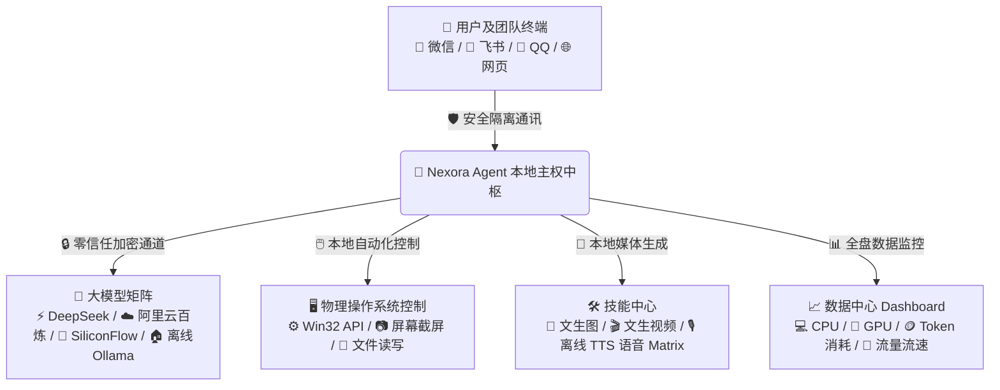
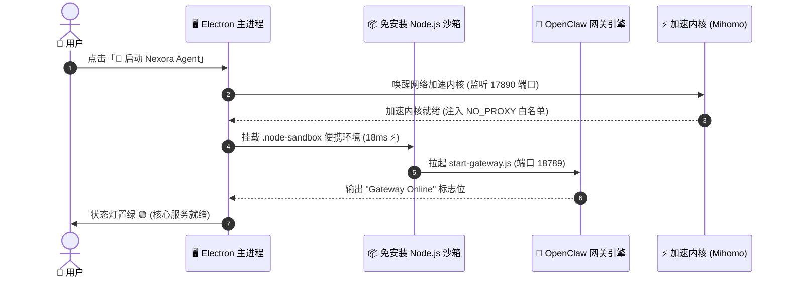
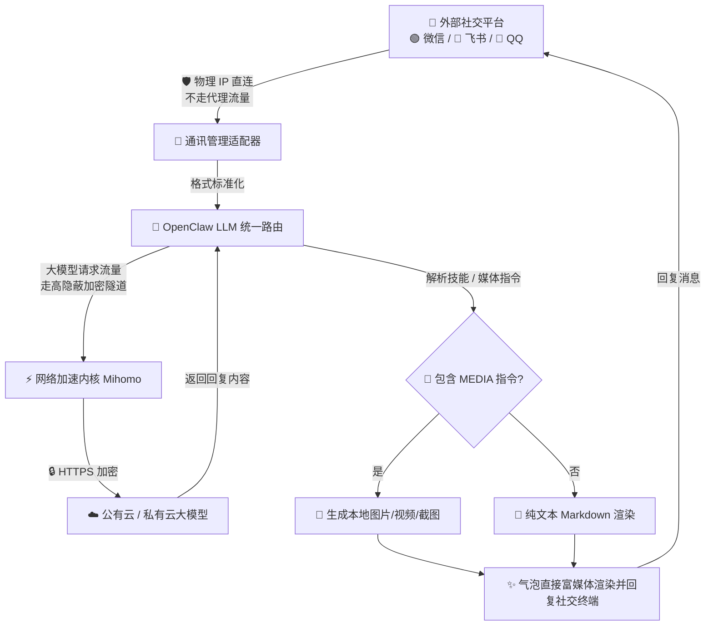
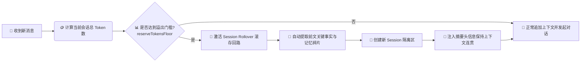
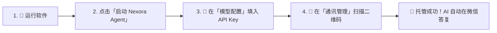

<div align="center">

<br />

<!-- ⚡ 100% 兼容无乱码·流光动态赛博 Header ⚡ -->


<br />
<br />

<p align="center">
  
</p>

### 🌌 Autonomous, Self-Healing & Distributed Local AI Intelligence Matrix

**✨ 贯通大模型生态与全渠道社交终端的零信任本地主权 AI 自动化中枢 ✨**

*Engineered for Absolute Privacy 🛡️. Powered by Local Intelligence 🧠. Driven by Zero-Trust Architecture 🔒.*

<br />

[](https://github.com/2014-y/NexoraAgent)
[](https://github.com/2014-y/NexoraAgent)
[](https://github.com/2014-y/NexoraAgent)
[](https://github.com/2014-y/NexoraAgent)
[](https://github.com/2014-y/NexoraAgent)
[](LICENSE)

<br />

[💡 系统用途与应用场景](#-💡-系统用途与全场景应用框架) •
[🖥️ 16大侧栏菜单功能逐一深度解析](#-🖥️-16-大侧栏菜单功能逐一深度解析) •
[🔄 系统运行全流程与机制](#-🔄-系统全链路运行流程与架构图解) •
[⚙️ 全套配置与部署指南](#-⚙️-全套部署配置与快速上手指南) •
[🏛️ 四层主权架构白皮书](#-🏛️-四层系统架构白皮书-four-tier-enterprise-architecture) •
[🛠️ 自愈诊断与故障排查](#-🛠️-故障诊断与自愈排查手册)

</div>

---

```text
   ███╗   ██╗███████╗██╗  ██╗██████╗ ██████╗  █████╗      █████╗  ██████╗ ███████╗██╗  ██╗████████╗
   ████╗  ██║██╔════╝╚██╗██╔╝██╔══██╗██╔══██╗██╔══██╗    ██╔══██╗██╔════╝ ██╔════╝██║  ██║╚══██╔══╝
   ██╔██╗ ██║█████╗   ╚███╔╝ ██████╔╝██████╔╝███████║    ███████║██║  ███╗█████╗  ███████║   ██║   
   ██║╚██╗██║██╔══╝   ██╔██╗ ██╔══██╗██╔══██╗██╔══██║    ██╔══██║██║   ██║██╔══╝  ██╔══██║   ██║   
   ██║ ╚████║███████╗██╔╝ ██╗██║  ██║██║  ██║██║  ██║    ██║  ██║╚██████╔╝███████╗██║  ██║   ██║   
   ╚═╝  ╚═══╝╚══════╝╚═╝  ╚═╝╚═╝  ╚═╝╚═╝  ╚═╝╚═╝  ╚═╝    ╚═╝  ╚═╝ ╚═════╝ ╚══════╝╚═╝  ╚═╝   ╚═╝   
```

---

## 🖥️ 极客拟态终端实时视界 (Cyberpunk Interactive Live Matrix) ⚡

```text
 ┌─────────────────────────────────────────────────────────────────────────────────────────────┐
 │ 🚀 NEXORA AGENT KERNEL TELEMETRY (SOVEREIGN ENGINE LIVE BOOT STREAM)                        │
 ├─────────────────────────────────────────────────────────────────────────────────────────────┤
 │ [SYSTEM]    Bootstrapping Nexora Agent Core Engine...                          [SUCCESS 🟢]  │
 │ [SANDBOX]   Attached Portable Node.js LTS Hardened Environment                 (18ms ⚡)    │
 │ [SECURITY]  Applied NO_PROXY Domain Identities. Zero-Trust Shield Active.      [SECURE 🛡️]   │
 │ [ROUTER]    Omni-Channel Connectors Loaded: WeChat 🟢, Feishu 🔷, QQBot 🐧, Slack 💬       │
 │ [RECONNECT] Exponential Backoff Circuit Breaker Primed. Auto-Retry Floor: Infinity          │
 │ [MEMORY]    Incremental Long-Term Memory Synced (~/.openclaw/MEMORY.md). Deduplicated. 🧠   │
 │ [ROLLOVER]  Session Overflow Rollover Circuit Armed. Auto-Compaction Ready. 🔄              │
 │ [SKILLS]    Loaded Native Skill Plugins: Image 🎨, Video 🎬, Desktop RPA 🖱️                  │
 │ [METRICS]   Data Center Telemetry Service Initialized on Local IPC Pipeline. 📊             │
 │ [GATEWAY]   Gateway Online at http://127.0.0.1:18789. All Systems Operational 🌌            │
 └─────────────────────────────────────────────────────────────────────────────────────────────┘
```

---

## 💡 系统用途与全场景应用框架 🌐

**Nexora Agent** 是一款面向个人智囊、企业私域与自动化运维的 **零信任本地主权 AI 自动化中枢** 🛡️。它将各大公有云/私有化大模型的认知能力与微信、飞书、QQ、钉钉等全渠道社交终端及物理操作系统无缝无痕无感连接 🔗。


```mermaid
graph TD
    A[👥 用户及团队终端<br/>💬 微信 / 🔷 飞书 / 🐧 QQ / 🌐 网页] -->|🛡️ 安全隔离通讯| B(🤖 Nexora Agent 本地主权中枢)
    B -->|🔒 零信任加密通道| C[🧠 大模型矩阵<br/>⚡ DeepSeek / ☁️ 阿里云百炼 / 🚀 SiliconFlow / 🏠 离线Ollama]
    B -->|🖱️ 本地自动化控制| D[🖥️ 物理操作系统控制<br/>⚙️ Win32 API / 📷 屏幕截屏 / 📁 文件读写]
    B -->|🎨 本地媒体生成| E[🛠️ 技能中心<br/>🎨 文生图 / 🎬 文生视频 / 🎙️ 离线 TTS 语音 Matrix]
    B -->|📊 全盘数据监控| F[📈 数据中心 Dashboard<br/>💻 CPU / 🧠 GPU / 🪙 Token 消耗 / 🌊 流量流速]
```

### 1. 👤 全渠道个人 AI 数字分身
* 💬 **微信 / 飞书 / QQ 消息自动托管**：手机不在身旁或工作繁忙时，助手可在后台实时接管特定好友或群聊，使用带有您个人专属记忆的语气与知识库准确回复。
* 🧠 **增量长期记忆萃取**：自动从对话中提取您的工作偏好、习惯与既定日程，保存至本地纯文本 Markdown 库，越用越懂得您的需求。

### 2. 🏢 企业级私域流量与客服自动化
* 🎧 **全双工智能客服**：无需昂贵的 SaaS 系统，在本地电脑即可拉起 7×24 小时微信/飞书客服机器人，支持多图发送、文档解析与智能故障排除。
* 🛡️ **防封号双路路由**：社交平台通信数据包纯本地 IP 直连，大模型 API 走加密隧道，技术层面规避风控封号风险。

### 3. 🖱️ 极客与开发者 RPA 桌面自动化
* 🖥️ **物理桌面控制**：AI 可直接分析当前屏幕内容，利用原生的 `user32.dll` 驱动模拟物理鼠标点击与键盘敲击，自动完成表单填写、软件测试与数据抓取。
* 📦 **离线安全沙箱**：基于隔离免安装 Node.js LTS 环境，即使执行复杂 Python/Shell 脚本，也不会影响宿主机的真实操作系统环境。

---

## ⚡ 核心能力网格 (Core Capability Grid) ✨

<table width="100%">
<tr>
<td width="33%" valign="top">
<h3>🛡️ 零信任物理隔离</h3>
<b>Zero-Trust Physical Isolation</b>
<p>🔒 所有的聊天日志、通讯凭证与记忆切片 100% 存放在本机磁盘，不经过任何第三方中间件。私密数据绝对不出本机。</p>
</td>
<td width="33%" valign="top">
<h3>⚡ 无限退避自动重连</h3>
<b>High-Availability Circuit Breaker</b>
<p>🔄 独创 v3 智能心跳监测算法。遇到局域网闪断或路由重启，自动开启指数退避静默热重连，45 秒内自适应恢复上线。</p>
</td>
<td width="33%" valign="top">
<h3>🌐 智能双路防封路由</h3>
<b>Anti-Anti-Agent Gateway</b>
<p>🛡️ 独创域名安全白名单分流。微信、飞书、QQ 官方心跳 100% 本地物理 IP 直连，大模型走代理加密，技术层面彻底防风控封号。</p>
</td>
</tr>
<tr>
<td width="33%" valign="top">
<h3>🧠 增量长期记忆中枢</h3>
<b>Markdown Long-Term Memory</b>
<p>📝 内置记忆自动提取与去重引擎。将用户的偏好与设定增量沉淀至本地 Markdown 库，跨会话自动注入 Prompt，打造越用越聪明的专属 AI 人格。</p>
</td>
<td width="33%" valign="top">
<h3>🗣️ 全离线神经网络语音</h3>
<b>Offline Neural Voice Matrix</b>
<p>🎙️ 集成 VAD 静音滑窗判定算法与 VITS 神经网络中英混合语音推理，配合 Windows SAPI COM 降级兜底，零网络依赖朗读。</p>
</td>
<td width="33%" valign="top">
<h3>🖥️ 物理级 Win32 桌面控制</h3>
<b>Win32 Synthetic Actuator</b>
<p>🖱️ 穿透 DPI 动态缩放，调用 user32.dll 物理事件驱动。大模型可如真人般操控 Windows 桌面，完成截图、点击与按键自动化。</p>
</td>
</tr>
<tr>
<td width="33%" valign="top">
<h3>🔄 超长会话无缝滚存</h3>
<b>Session Overflow Rollover</b>
<p>📑 突破 Token 长度限制。当会话超出上下文阈值时，自动提取关键摘要并滚存至新会话，保持长期对话连续不中断。</p>
</td>
<td width="33%" valign="top">
<h3>🛠️ 技能扩展中枢</h3>
<b>Native Skill Center</b>
<p>🎨 提供生图、生视频、抓屏与网络诊断等多维技能插件，支持热加载与灵活调度，大幅扩展大模型的能力边界。</p>
</td>
<td width="33%" valign="top">
<h3>📊 数据中心仪表盘</h3>
<b>Data Center Telemetry</b>
<p>📈 提供全盘可视化监控，实时图表展示 CPU/内存/网络吞吐量及 Token 消耗动态，系统健康度一清二楚。</p>
</td>
</tr>
</table>

---

## 🖥️ 16 大侧栏菜单功能逐一深度解析 📌

系统左侧导航栏集成了 16 个核心功能面板与管理视界，以下为您逐一清清楚楚、明明白白详细拆解 💡：

```text
 ┌──────────────────────┬───────────────────────────────────────────────────────────────────────┐
 │ NEXORA AGENT NAV 🚀  │ 🟢 核心服务就绪 | 端口: 18789  [ 🚀 启动/终止 ] [ 🔍 探针诊断 ]         │
 ├──────────────────────┼───────────────────────────────────────────────────────────────────────┤
 │ ⚡ 1. Agent (控制台) │ 🚀 核心服务控制台、三色指示灯状态控制、启动探针管理                   │
 │ ⚡ 2. Clash (加速通道)│ 🌐 内置 Mihomo 网络加速内核配置、NO_PROXY 社交白名单分流               │
 │ 📊 3. 数据中心       │ 📈 可视化 Dashboard、CPU/内存/网络带宽/Token 消耗实时折线图             │
 │ 💬 4. 模型会话       │ 💬 实时 AI 对话交互、滚存上下文视界、媒体富文本气泡渲染                 │
 │ 📂 5. 会话归档       │ 📁 历史超长会话检索、滚存备份记录查看与 Markdown 一键导出              │
 │ 🧠 6. 模型配置       │ 🔑 大模型厂商 API Key 注入、模型探针、识图/视觉模型自动对齐            │
 │ 📱 7. 通讯管理       │ 📱 微信/飞书/QQ/Slack/Matrix 全渠道机器人卡片与扫码绑定                │
 │ 🎭 8. 模型角色       │ 🎭 系统 Prompt 提示词预设、AI 人格与语气模板库                         │
 │ 🦞 9. OpenClaw 面板  │ 🦞 原生底层 Web 管理面板无缝嵌套与赛博暗黑主题同步                     │
 │ 📈 10. 用量监控      │ 🪙 Token 消费统计、模型调用频次与首字延迟 (TTFT) 深度耗时分析          │
 │ 🧩 11. 内置插件      │ 🧩 插件生态列表、插件启停与动态热加载控制                              │
 │ 🛠️ 12. 技能中心      │ 🎨 文生图、🎬 文生视频、🖱️ 物理桌面 RPA、📷 网页截屏技能扩展            │
 │ 🎙️ 13. 语音管理      │ 🎙️ VAD 滑动窗口概率推导离线语音、Sherpa-Onnx 神经网络与 SAPI 声卡朗读   │
 │ 💻 14. 内置终端      │ 💻 免安装便携 PTY 伪终端控制台，支持命令行脚本直接交互                  │
 │ 📜 15. 运行日志      │ 📜 实时流式 stdout/stderr 日志捕获与级别过滤视界                       │
 │ ⚙️ 16. 系统设置      │ ⚙️ 语言切换 (i18n)、开机自启、高级参数与 Doctor 诊断面板               │
 └──────────────────────┴───────────────────────────────────────────────────────────────────────┘
```

---

### 1. ⚡ Agent (控制台面板 `console-view`)
* 🚀 **核心功能**：软件的核心总控台。在此可一键控制本地 Agent 服务的拉起与终止。
* 🔘 **主要控件与界面元素**：
  * **主启动/停止按键**：点击一键启动或关闭 Agent 服务后台线程。
  * **实时三色指示灯**：🔴 **已停止**、🟡 **启动中 (沙箱挂载中)**、🟢 **已就绪**。
  * **端口与加载百分比**：实时显示网关监听的本地端口（默认 `18789`）及 0-100% 加载进度。
* ⚙️ **底层机制**：触发后台自动挂载 `.node-sandbox` 免安装便携环境，拉起 Gateway 核心主进程。

---

### 2. ⚡ Clash (网络加速通道 `acceleration-view`)
* 🌐 **核心功能**：管理内置的 Mihomo 加速内核与防封安全代理路由。
* 🔘 **主要控件与界面元素**：
  * **代理模式切换**：支持 `规则分流 (Rule)`、`全局加密 (Global)` 与 `直连模式 (Direct)` 自由切换。
  * **订阅节点配置**：支持导入自定义加密加速订阅链接与节点选择。
  * **NO_PROXY 白名单字典**：内置微信、飞书、QQBot 官方服务器域名白名单，强行绕过代理。
* 🛡️ **底层机制**：社交平台数据包纯本地物理 IP 传输（技术防封号），大模型流量走高隐蔽加密加速。

---

### 3. 📊 数据中心 (Data Center Dashboard `data-center-view`)
* 📈 **核心功能**：全盘可视化系统运维与性能 Telemetry 实时仪表盘。
* 🔘 **主要控件与界面元素**：
  * **CPU & 内存占用折线图**：动态刷新展示 CPU 使用率 (%) 与内存占用 (MB/GB) 变化。
  * **网络吞吐带宽流速**：实时显示上行 (Upload) 与下行 (Download) KB/s 流量速率。
  * **Token 消耗分布图**：按模型与时间维度展示输入 Token、输出 Token 及累计消耗。
* 💻 **底层机制**：通过专用的 IPC 通道实时采集沙箱与系统的硬件计数器，渲染为 ECharts 动态图表。

---

### 4. 💬 模型会话 (模型交互主视界 `chat-view`)
* 💬 **核心功能**：与本地或云端大模型进行实时全功能交互。
* 🔘 **主要控件与界面元素**：
  * **模型切换下拉框**：随时切换当前生效的大模型（如 DeepSeek, Qwen, Ollama 等）。
  * **富媒体气泡区**：完美支持 Markdown 语法、代码高亮一键复制、LaTeX 数学公式、本地图片/视频/音频直接预览播放。
  * **清空/新建会话**：快速重置当前上下文或开启独立对话空间。
* 🔄 **底层机制**：内置会话无缝滚存回路 (Session Overflow Rollover)，当上下文超出 Token 阈值时自动提取摘要并滚存至新会话。

---

### 5. 📂 会话归档 (会话历史管理 `session-archive-view`)
* 📁 **核心功能**：检索、管理与导出所有的历史对话记录及溢出滚存备份。
* 🔘 **主要控件与界面元素**：
  * **历史列表卡片**：按时间倒序排列展示过往的所有对话会话与摘要信息。
  * **检索搜索框**：支持根据关键词快速过滤查找历史聊天记录。
  * **导出与备份**：支持将会话记录一键导出为纯文本或 Markdown 格式文件。

---

### 6. 🧠 模型配置 (模型供应商矩阵 `config-view`)
* 🔑 **核心功能**：统一配置大模型厂商 API Key、服务端点与视觉对齐参数。
* 🔘 **主要控件与界面元素**：
  * **厂商启停开关**：支持一键启用/禁用 DeepSeek、阿里云百炼 (Qwen)、SiliconFlow、OpenAI、Ollama 等供应商。
  * **API Key 填报区**：加密字典本地存储，凭证绝对不出本机。
  * **连通性探针测试**：点击「测试连接」，瞬间返回 API 连通延迟 (ms) 与可用状态。
  * **视觉模型自动对齐 (Vision Alignment)**：自动将包含图片理解能力的模型标记为 `text+image` 模式。

---

### 7. 📱 通讯管理 (社交渠道托管 `communication-view`)
* 📱 **核心功能**：托管微信、飞书、QQBot、Slack、Matrix 等全渠道社交机器人。
* 🔘 **主要控件与界面元素**：
  * **渠道状态卡片**：展示各平台的连接状态（🟢 运行中 / 🔴 已停止）。
  * **扫码绑定按键**：点击一键生成二维码弹窗，微信/飞书手机扫码即可确认登录。
  * **参数配置面板**：配置飞书 App ID / App Secret、QQBot AppID 等机器人凭证。
* 🔄 **底层机制**：内嵌 v3 高可用重连引擎，遇局域网断网自动启动指数退避静默热重连，45 秒内自适应上线。

---

### 8. 🎭 模型角色 (AI 人格与提示词预设 `roles-view`)
* 🎭 **核心功能**：定制 AI 助手的系统 Prompt 提示词、语气、性格与专业领域。
* 🔘 **主要控件与界面元素**：
  * **预设角色卡片库**：内置代码专家、翻译官、私域客服、文案大师等多种角色模板。
  * **新建/编辑角色**：自定义注入 System Prompt、温度值 (Temperature) 与思维链路参数。

---

### 9. 🦞 OpenClaw (原生网关 Web 面板 `openclaw-panel-view`)
* 🦞 **核心功能**：无缝内嵌 OpenClaw 底层网关的原生管理 Web 视界。
* 🔘 **主要控件与界面元素**：
  * **Webview 视图**：直接在客户端内部浏览与操作原生底层网关。
  * **自动赛博暗黑主题同步**：自动将外部 UI 的深色暗黑主题注入 Webview 内，实现无缝视觉融合。

---

### 10. 📈 用量监控 (成本与调用统计 `dashboard-view`)
* 🪙 **核心功能**：深度分析大模型调用的频次、Token 消费与响应耗时。
* 🔘 **主要控件与界面元素**：
  * **调用频次分布**：按小时/天维度展示 API 的调用次数。
  * **首字延迟 (TTFT) 统计**：分析不同大模型厂商的响应速度与稳定度。

---

### 11. 🧩 内置插件 (插件生态列表 `plugins-view`)
* 🧩 **核心功能**：查看、管理与配置系统中安装的所有功能插件。
* 🔘 **主要控件与界面元素**：
  * **插件生态列表**：展示已加载的插件（如错误过滤插件、自动滚存插件、内存轮转插件等）。
  * **启停开关与配置**：支持对单个插件进行一键启用、禁用与参数调整。

---

### 12. 🛠️ 技能中心 (Native Skill Center `skills-view`)
* 🛠️ **核心功能**：管理与扩展 AI 大模型的物理执行技能。
* 🔘 **主要控件与技能项**：
  * 📷 **桌面抓屏 (Screen Capture)**：调用物理抓屏工具截取屏幕并分析。
  * 🖱️ **桌面操控 (Desktop Control)**：通过 user32.dll 事件驱动模拟真实键盘与鼠标点击。
  * 🎨 **文生图插件 (Image Generator)**：通过提示词生成高清图片并直接渲染到气泡。
  * 🎬 **文生视频插件 (Video Generator)**：生成动态视频片段。

---

### 13. 🎙️ 语音管理 (全离线神经网络语音 `voice-view`)
* 🎙️ **核心功能**：管理离线语音识别 (ASR) 与神经网络语音合成 (TTS)。
* 🔘 **主要控件与界面元素**：
  * **VAD 滑动窗口参数**：设置语音活动的概率推导阈值与静音截断时长。
  * **发音人与语速选择**：选择不同的 Sherpa-Onnx 离线神经网络发音人声音。
  * **SAPI 兜底开关**：无神经网络模型时自动降级至 Windows 本地系统声卡朗读。

---

### 14. 💻 内置终端 (便携 PTY 命令行 `terminal-view`)
* 💻 **核心功能**：在应用内提供一个隔离的免安装便携 PTY 命令行控制台。
* 🔘 **主要控件与界面元素**：
  * **终端交互控制台**：支持直接输入 PowerShell / Cmd / Bash 命令。
  * **快捷命令脚本集**：内置一键检查端口、查看日志、清理缓存等命令行脚本。

---

### 15. 📜 运行日志 (实时流式日志 `syslogs-view`)
* 📜 **核心功能**：实时捕获并流式输出后台沙箱与网关的 stdout / stderr 运行日志。
* 🔘 **主要控件与界面元素**：
  * **流式日志窗口**：按时间戳高亮输出系统运行的每一个细节。
  * **级别过滤与搜索**：支持过滤 `INFO`、`WARN`、`ERROR` 日志级别。

---

### 16. ⚙️ 系统设置 (系统偏好与自愈诊断 `settings-view`)
* ⚙️ **核心功能**：软件的全局偏好设置与系统自愈诊断面板。
* 🔘 **主要控件与界面元素**：
  * **多语言切换 (i18n)**：支持中文、英文等多国语言界面无缝切换。
  * **开机自动启动**：设置软件随系统开机静默启动并在后台运行。
  * **系统完整性诊断 (Doctor Probe)**：一键扫描系统依赖、端口占用与沙箱健康状态。

---

## 🔄 系统全链路运行流程与架构图解 🚀

### 1. 🚀 软件启动与沙箱挂载流程

```mermaid
sequenceDiagram
    autonumber
    actor User as 👤 用户
    participant Main as 🖥️ Electron 主进程
    participant Sandbox as 📦 免安装 Node.js 沙箱
    participant Gateway as 🦞 OpenClaw 网关引擎
    participant Proxy as ⚡ 加速内核 (Mihomo)

    User->>Main: 点击「🚀 启动 Nexora Agent」
    Main->>Proxy: 唤醒网络加速内核 (监听 17890 端口)
    Proxy-->>Main: 加速内核就绪 (注入 NO_PROXY 白名单)
    Main->>Sandbox: 挂载 .node-sandbox 便携环境 (18ms ⚡)
    Sandbox->>Gateway: 拉起 start-gateway.js (端口 18789)
    Gateway-->>Main: 输出 "Gateway Online" 标志位
    Main->>User: 状态灯置绿 🟢 (核心服务就绪)
```

### 2. 🌐 多渠道消息收发与防封分流流程

```mermaid
flowchart TD
    A[📱 外部社交平台<br/>🟢 微信 / 🔷 飞书 / 🐧 QQ] -->|🛡️ 物理 IP 直连<br/>不走代理流量| B[📱 通讯管理适配器]
    B -->|格式标准化| C[🧠 OpenClaw LLM 统一路由]
    C -->|大模型请求流量<br/>走高隐蔽加密隧道| D[⚡ 网络加速内核 Mihomo]
    D -->|🔒 HTTPS 加密| E[☁️ 公有云 / 私有云大模型]
    E -->|返回回复内容| C
    C -->|解析技能 / 媒体指令| F{🎨 包含 MEDIA 指令?}
    F -- 是 --> G[🎨 生成本地图片/视频/截图]
    F -- 否 --> H[💬 纯文本 Markdown 渲染]
    G --> I[✨ 气泡直接富媒体渲染并回复社交终端]
    H --> I
    I -->|回复消息| A
```

### 3. 🔄 上下文超长自动无缝滚存 (Session Overflow Rollover) 流程

```mermaid
flowchart LR
    A[📩 收到新消息] --> B(🪙 计算当前会话总 Token 数)
    B --> C{📊 是否达到溢出门槛?<br/>reserveTokensFloor}
    C -- 否 --> D[💬 正常追加上下文并发起对话]
    C -- 是 --> E[🔄 激活 Session Rollover 滚存回路]
    E --> F[📝 自动提取前文关键事实与记忆碎片]
    F --> G[📁 创建新 Session 隔离区]
    G --> H[📌 注入摘要头信息保持上下文连贯]
    H --> D
```

---

## ⚙️ 全套部署配置与快速上手指南 📦

### 1. 🚀 极速安装与部署 (3 分钟上手)
1. 📦 **下载安装包**：在仓库 Releases 或官方发布渠道获取 `Nexora Agent Setup.exe` 安装文件。
2. 🛠️ **图形化安装**：双击运行安装向导，按照提示选择安装路径，软件会自动完成桌面快捷方式建立。
3. 📦 **零环境准备**：软件**内置全套免安装 Node.js 沙箱环境**，您的电脑无需预装任何 Node.js、Python 或 Git 环境即可直接运行。

### 2. 🎯 第一次配置与使用步骤

```mermaid
flowchart LR
    Step1[1. 🚀 运行软件] --> Step2[2. 点击「启动 Nexora Agent」]
    Step2 --> Step3[3. 🧠 在「模型配置」填入 API Key]
    Step3 --> Step4[4. 📱 在「通讯管理」扫描二维码]
    Step4 --> Step5[🎉 托管成功！AI 自动在微信答复]
```

> [!TIP]
> 💡 **推荐模型配置**：若您初次使用，推荐选择 `DeepSeek` 或 `阿里云百炼 (Qwen)` 厂商，填入您申请到的 API Key，不仅响应速度极快，且具备优秀的推理与文本生成能力。

---

## 🏛️ 四层系统架构白皮书 (Four-Tier Enterprise Architecture) 🛡️

Nexora Agent 采用了分层解耦的四层软件架构设计，保障了系统的极高可靠性与扩展性 💎：

```text
+-----------------------------------------------------------------------------------+
| Layer 3: Omni-Channel Actuators & Interface (全双工适配与交互层 📱)                 |
| - WeChat Connector 🟢 / Feishu Connector 🔷 / QQBot Connector 🐧                   |
| - Sherpa-Onnx Neural ASR & VITS TTS Offline Voice Gateway 🎙️                       |
| - Inline Media Rich-Text Bubble Renderer & Data Center Telemetry 📊               |
+-----------------------------------------------------------------------------------+
                                   │ (JSON-RPC / WebSockets / IPC)
                                   ▼
+-----------------------------------------------------------------------------------+
| Layer 2: Cognitive Engine & Memory Matrix (认知智能与记忆中枢层 🧠)               |
| - OpenClaw LLM Router & Unified OpenAI Protocol Translator                        |
| - Markdown-based Incremental Long-Term Memory Deduplicator (MEMORY.md) 📝          |
| - Context Compaction & Token Salience Floor (reserveTokensFloor)                  |
| - Automatic Session Overflow Seamless Rollover Engine 🔄                          |
+-----------------------------------------------------------------------------------+
                                   │ (Loopback Proxy / Internal Mesh)
                                   ▼
+-----------------------------------------------------------------------------------+
| Layer 1: Protocol Proxy & Security Firewall (安全协议与防封路由层 🛡️)               |
| - Mihomo Core Agent (Local Port 17890) ⚡                                         |
| - NO_PROXY White-List Traffic Separator (*.weixin.qq.com / *.feishu.cn) 🌐        |
| - Automatic Crash-Loop Breaker Bypass & Override Handler 🛠️                       |
+-----------------------------------------------------------------------------------+
                                   │ (Win32 System Calls & Native Addons)
                                   ▼
+-----------------------------------------------------------------------------------+
| Layer 0: Hardware, Runtime & OS Sandbox (物理硬件与系统沙箱层 📦)                   |
| - Portable Node.js LTS Sandbox & node:sqlite Engine                               |
| - Win32 User32.dll Direct Input Driver (Synthetic Mouse/Keyboard Injection) 🖱️     |
| - Multi-Monitor High-DPI Desktop Capture Engine 📷                                |
+-----------------------------------------------------------------------------------+
```

---

## 🛠️ 故障诊断与自愈排查手册 🔍

> [!NOTE]
> 💡 常见的系统运行问题均可根据以下排查指南在数秒内完成自主修复：

<table width="100%">
<thead>
<tr>
<th align="left">🔍 故障现象</th>
<th align="left">⚠️ 底层诱发原因</th>
<th align="left">🛠️ 自愈排查解决方案</th>
</tr>
</thead>
<tbody>
<tr>
<td><b>通道提示 <code>crash-loop breaker tripped</code></b></td>
<td>多次强制杀死进程导致异常关机计数超限</td>
<td>最新系统已内置自愈。点击「终止服务」后再点击「启动」，主进程会自动擦除锁定标号。</td>
</tr>
<tr>
<td><b>微信连接成功但网络断开后不自动恢复</b></td>
<td>网络波动引发 WebSocket 物理连接断开</td>
<td>系统已内置 v3 高可用重连引擎，网络恢复后 45 秒内自动静默热重连，无需重新扫码。</td>
</tr>
<tr>
<td><b>语音网桥报错 <code>ECONNREFUSED 18791</code></b></td>
<td>语音服务未开启或 18791 端口被残留进程占用</td>
<td>进入「系统设置」 $\rightarrow$ 取消勾选「开启语音」 $\rightarrow$ 2 秒后重新勾选开启，强制强置端口。</td>
</tr>
<tr>
<td><b>加速内核提示 <code>17890</code> 端口冲突</b></td>
<td>本地运行了 v2rayN 或 Clash 等第三方软件占用端口</td>
<td>关闭第三方软件，或在设置面板中将 HTTP 加速端口修改为其他空闲端口（如 17898）。</td>
</tr>
<tr>
<td><b>扫码后提示二维码失效</b></td>
<td>二维码生成超时或手机确认时间过长</td>
<td>在「通讯管理」中点击「重新生成二维码」，掏出手机即刻扫描并点击确认。</td>
</tr>
</tbody>
</table>

---

## 👨‍💻 开发者二次开发与插件扩展 🚀

### 1. 本地构建与源码调试
```bash
# 克隆项目代码仓库
git clone https://github.com/2014-y/NexoraAgent.git
cd NexoraAgent

# 安装本地依赖
npm install

# 启动 Electron 本地开发调试模式
npm run app:start

# 构建一键安装包 (NSIS Installer)
npm run app:dist
```

### 2. 编写自定义技能插件
在 `plugins/my-custom-skill/` 目录下创建 `index.js`：

```javascript
'use strict';

class CustomSkillPlugin {
  constructor(context) {
    this.ctx = context; // 注入系统主权上下文
  }

  async onload() {
    this.ctx.log?.info('[CustomSkill] 技能插件成功加载');
    // 注册自定义路由或工具监听
  }

  async onunload() {
    this.ctx.log?.info('[CustomSkill] 技能插件已卸载');
  }
}

module.exports = CustomSkillPlugin;
```

---

## 📄 许可证协议 (License) ⚖️

本项目基于 **[MIT License](LICENSE)** 开源协议发布。您可以自由修改、商业化部署、二次开发或分发。

---

<div align="center">
  <b>Built with ❤️ by Nexora Team.</b><br />
  <i>Empowering Autonomous Local AI Agents everywhere 🌌.</i>
</div>
