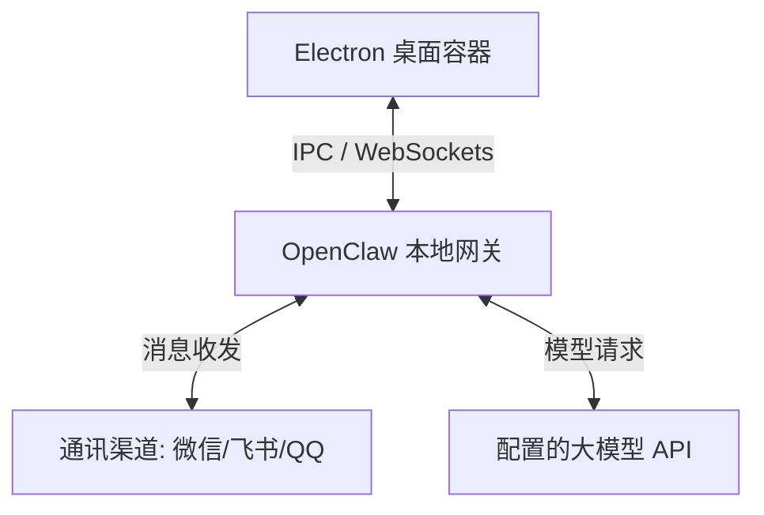

# Nexora Agent 核心技术架构与规格说明书

---

## 前言

**Nexora Agent** 是一款专为小白用户和普通开发者打造的本地 AI 智能助手桌面版应用。它致力于在本地硬件环境中构建起一座连接“大模型智慧”与“日常通讯协作工具（微信、QQ、飞书等）”之间的桥梁。

本文档从底层设计哲学、系统架构蓝图、运行隔离沙箱、智能路由网关、计算机自动化控制等多个维度，对 Nexora Agent 进行了深度技术剖析，旨在清晰讲述其**底层原理、核心功能、数据流转过程、关键技术栈及具体实现方式**。

---

## 1. Nexora Agent 核心设计哲学与架构蓝图

### 1.1 设计背景与核心痛点
传统的 AI Agent 接入通讯渠道（例如将大模型变成微信聊天助手）通常面临以下几个核心痛点：
1. **环境依赖繁琐**：通常需要手动安装 Node.js、Python 等环境，配置复杂的系统环境变量，极易因为版本不匹配而报错。
2. **数据隐私隐患**：许多一键式接入工具将用户数据上传到中心化服务器，导致大模型 API 密钥、聊天记录等隐私泄漏。
3. **性能损耗与死锁**：Node.js 单线程模型在面对大量文件读写（解包）时，一旦同步阻塞主线程，极易导致客户端卡死、系统判定为“未响应”。

Nexora Agent 围绕 **“开箱即用、隐私本地化、运行隔离、体验流畅”** 的核心哲学进行设计，通过桌面客户端的形态提供了一站式解决方案。

### 1.2 整体架构设计（分层模型）
Nexora Agent 按桌面交互与网关服务分层组织：



- **第一层：GUI 交互与进程托管层（Electron 桌面容器）**
  基于 Electron 平台，负责提供现代的视觉交互、管理软件生命周期、守护本地服务进程。
- **第二层：本地微服务网关层（OpenClaw 核心 & 辅助运行时）**
  - **OpenClaw 本地网关（调度中枢）**：核心的智能消息路由系统，用于加载配置、载入多平台通讯插件、连接大模型 API、解析插件 MCP 等。

### 1.3 核心技术栈矩阵
| 层次 / 模块 | 技术选型 | 说明 |
| :--- | :--- | :--- |
| **应用外壳** | Electron | 跨平台桌面客户端容器 |
| **界面表现** | Vanilla HTML5 + CSS3 + ES6 | 轻量，无框架开销，极速加载 |
| **调度中枢** | OpenClaw (Node.js LTS) | 模块化 AI 消息网关与多通道集成框架 |
| **通讯插件** | `@tencent-weixin/openclaw-weixin`, Feishu SDK, QQBot SDK | 通讯通道接入包 |
| **终端展现** | `node-pty` + `xterm.js` | 实时渲染控制台日志，模拟真实命令行环境 |
| **物理控制** | `open-computer-use` + PowerShell 脚本 | 控制本机的截图、鼠标键盘事件模拟 |

### 1.4 Electron 主进程与渲染进程分工
- **主进程 (Main Process - [main.js](file:///c:/Users/Yuan/Desktop/ClawAI/NexoraAgent/main.js))**：
  拥有操作系统的完全访问权限。负责在系统后台冷启动 Node.js 沙箱环境、拉起 OpenClaw 子进程；拦截未捕获异常并输出到 `main_error.log`；通过 `ipcMain` 注册大量系统级 API 供渲染进程调用。
- **渲染进程 (Renderer Process - [renderer.js](file:///c:/Users/Yuan/Desktop/ClawAI/NexoraAgent/renderer.js))**：
  在隔离的沙箱环境（启用 contextIsolation）中运行，通过 [preload.js](file:///c:/Users/Yuan/Desktop/ClawAI/NexoraAgent/preload.js) 暴露的 IPC 桥梁访问主进程接口。负责渲染 UI 面板、处理用户操作逻辑、配置模型 Key、展示二维码以及实时渲染 `xterm.js` 传递来的子进程控制台标准输出（stdout）。

---

## 2. 运行环境隔离与本地绿色沙箱技术

### 2.1 独立 Node 运行环境机制 (.node-sandbox)
普通小白用户的电脑通常没有配置 Node.js 开发环境，若让用户自行去配置环境，极易发生各种路径与权限问题。
为此，Nexora Agent 在打包发布包时，在安装目录下内置了一套完整、绿色的 Node.js 压缩沙箱目录 `.node-sandbox`，其中包含了 `node.exe` 及其基础 npm 执行器。

**探活与降级逻辑（主进程 [main.js:119-149](file:///c:/Users/Yuan/Desktop/ClawAI/NexoraAgent/main.js#L119-L149)）**：
1. 主进程首先在本地定位 `.node-sandbox/node.exe`。
2. 使用 `child_process.execFileSync` 同步运行该程序并传入 `-v` 参数进行探活。
3. 若由于操作系统未安装必要的 VC++ 2015-2022 运行库（DLL 缺失）或被 Windows 用户组安全策略限制执行，`execFileSync` 将会抛出异常。
4. 主进程捕捉到异常后，会自动触发降级（Fallback）机制：通过执行命令 `where node` 查找系统全局的环境变量 Node 路径；若全局存在 Node 且版本符合要求（$\ge$ v22），则选用全局 Node 启动网关。
5. 若两者皆不可用，则弹出系统级对话框报错，防止程序在无 Node 状态下静默闪退。

### 2.2 启动加固与运行时解包 (gateway-runtime.js)

**分层解压策略**：
- 静态资源、主渲染进程脚本保留在 `app.asar` 中以确保启动速度。
- 底层网关运行时（OpenClaw 及其全部核心依赖包）在打包前，通过脚本 `pack-gateway-runtime.js` 离线预打包为 `.tar` 文件（`gateway-runtime.tar`），存放在 Electron 的 `extraResources` 中。
- 客户端在首次启动时，异步读取该 `tar` 包，解压到用户目录 `%LOCALAPPDATA%\NexoraAgent\gateway-runtime` 中。
- 解压过程使用子进程异步调用系统 `tar` 命令（[gateway-runtime.js:155-172](file:///c:/Users/Yuan/Desktop/ClawAI/NexoraAgent/gateway-runtime.js#L155-L172)）。若执行失败，会启动一个拥有 `Bypass` 执行策略的 PowerShell 子进程：
  ```powershell
  powershell -NoProfile -ExecutionPolicy Bypass -Command "tar -xf 'tarPath' -C 'destDir'"
  ```
  以此确保在受限环境下仍能正常解包。

### 2.3 伪终端与控制台日志投递 (node-pty + xterm.js)
为了给技术人员或需要排错的用户提供可视化的终端输出，Nexora Agent 并没有把子进程的日志简单重定向到只读的文本框中，而是集成了 `node-pty` 和 `xterm.js`。

**技术实现方式**：
- 在主进程中，使用 `node-pty` 在 Windows 操作系统上拉起一个真正的 Pseudoterminal (PTY) 子进程，绑定系统的 Shell（如 cmd.exe 或 powershell.exe），并在该终端内执行 `node start-gateway.js`。
- `node-pty` 捕获终端返回的原始 ANSI 控制字符（包含高亮颜色、进度条渲染、换行回车等）。
- 主进程通过 IPC 事件 `builtin-terminal-data`，实时将这些原始 ANSI 字节流投递到渲染进程。
- 渲染进程使用 `xterm.js` 结合 `xterm-addon-fit` 插件，将字节流实时渲染在前端页面上，呈现出完美的彩色控制台效果。
- 渲染进程的按键事件同样通过 `builtin-terminal-write` 反向传给主进程的 `node-pty`，从而使用户可以直接在 Electron 界面上对后台的子进程终端进行控制交互。

---

## 3. 智能网关路由与多平台通讯引擎 (OpenClaw & Channel Connectors)

### 3.1 调度中枢 (OpenClaw) 工作原理
OpenClaw 是 Nexora Agent 的核心调度网关。它的核心配置文件是位于 `%USERPROFILE%\.openclaw\openclaw.json`（备份文件在根目录下）。
网关启动后，会在本地监听特定的控制端口（默认 `18789`）。

其工作流如下：
1. **启动插件容器**：根据 `openclaw.json` 加载启用的通讯通道插件（如 `@tencent-weixin/openclaw-weixin`、`@openclaw/feishu`）。
2. **初始化鉴权体系**：生成并读取本地控制 Token，为主渲染进程的控制台提供基于 HTTP / WebSocket 鉴权的长链接。

### 3.2 长期记忆机制 (MEMORY.md 动态交互)
Nexora Agent 不是一问一答的“断忆”助手，它集成了基于本地的长期记忆栈（Long-term Memory Stack）。

**实现方式**：
- 在用户的配置目录（如 `%USERPROFILE%\.openclaw`）中，程序会维护一个 `MEMORY.md` 文件。
- 该文件以 Markdown 的层级结构持久化存储 AI 在与用户交互过程中沉淀下来的“记忆事实”（包括用户的喜好、过往设定、特定上下文等）。
- 当通讯通道接收到用户发来的消息时，OpenClaw 路由层会在构造向大模型发送的 Prompt 之前，首先异步读取并解析 `MEMORY.md` 里的关键上下文。
- 它利用轻量级的文本提取或者特定的记忆策略，将相关的记忆切片拼接到 System Prompt 或是 User Prompt 顶部。
- 每次对话结束后，AI 助手内部运行的系统级插件会检测是否有新的长期事实产生，若有，则会自动在后台对 `MEMORY.md` 进行增量写入或重构，实现“助手越用越懂你”。

### 3.3 扫码登录与会话保持机制
对于微信等网页版/协议版通讯工具，其登录凭证包含极高时效性的 Cookie 和 Session Key，传统的做法是每次启动重新扫码。

**Nexora Agent 的会话保持方案**：
- 用户点击「扫码绑定」时，底层微信通道插件启动，向微信服务器申请登录 UUID，并产生一个登录二维码的二进制流。
- 主进程通过 IPC 将此流以 Base64 格式传递给渲染进程，在前端界面直接以 QR 码图片展示。
- 当用户手机端扫码并确认后，微信通道插件在网关内存中建立与微信长连接（WebSocket / HTTP Long-polling）的会话（Session）。
- 程序会将该会话的部分加密凭证（例如微信的登录 State、本地 Token 等）序列化写入 `%USERPROFILE%\.openclaw` 目录下的状态缓存文件中（如 `openclaw-state.js` 管理的临时持久化数据库）。
- 只要客户端正常退出（未发生崩溃死锁），下一次启动时，微信通道会尝试去读取本地的状态缓存文件，并直接调用微信的“热启动（Hot Reconnect）”接口进行自动连接。如果连接成功，用户便无需再次扫码，真正实现了无缝会话保持。

### 3.4 陌生人配对与白名单安全机制
为防范恶意用户通过私信或者大量微信群聊狂刷用户的 API 额度，Nexora Agent 引入了陌生人授权配对和白名单风控限制。

**工作方式**：
- 当一个未授权的陌生账号（即不在已配对的白名单列表中）第一次给接入了 AI 的微信/飞书发消息时，网关的拦截层会立刻截获此消息，不向上层大模型进行调用投递。
- 拦截层会反向给该用户自动发送一条预设的提示：“您好，我是主人的 AI 助手。为了防止额度滥用，请向主人申请加白。您的专属配对码是：`[XXXX]`”。
- 同时，Nexora Agent 的 Electron 客户端界面会通过 IPC 收到一条配对申请事件，界面右上角会弹出系统通知提示，并在「通讯管理」的面板中增加一条待审核记录。
- 只有当主人在电脑客户端界面上手动点击「同意配对」后，该账号的 ID 才会真正被写入本地白名单配置文件中，之后他发出的每一条消息才能被大模型接收并得到自动回复。

---

## 4. AI 物理控制与桌面使用架构 (Computer Use & Automation)

### 4.1 open-computer-use 框架
大语言模型的发展催生了 Agent 能够像人一样操作电脑的需求。Nexora Agent 引进了 `open-computer-use`（对应依赖 `open-computer-use: 0.1.54`），为本地 AI 赋予了物理操作系统的控制权限（Computer Use）。

### 4.2 桌面截图与操作系统指令映射 (PowerShell 自动化)
当网关侧的大模型输出中包含 `Computer Use` 的 Action（例如点击、拖拽、打字、截图等）时，网关会通过物理调用本机的 PowerShell 脚本来执行具体操作。

- **桌面截图 ([capture-desktop.ps1](file:///c:/Users/Yuan/Desktop/ClawAI/NexoraAgent/capture-desktop.ps1))**：
  在 Windows 下，传统的截图库由于权限限制或多屏幕兼容问题极易报错。
  Nexora Agent 选用 PowerShell 脚本，利用 .NET 框架的 `[System.Drawing.Graphics]::CopyFromScreen` 接口。
  该脚本能够高兼容性地捕获用户当前的物理主屏幕画面，压缩成高画质的 JPEG 格式，输出到指定的本地缓存文件中，再由网关将图像转换成 Base64 格式喂给支持多模态的视觉模型（如 Claude 3.5 Sonnet / GPT-4o）。
- **鼠标键盘模拟与控制 ([desktop-control.ps1](file:///c:/Users/Yuan/Desktop/ClawAI/NexoraAgent/desktop-control.ps1))**：
  模型识别屏幕图像后，输出目标操作的相对坐标 $(x, y)$。
  网关解析此坐标，并通过参数形式启动 `desktop-control.ps1` 脚本。
  脚本在底层引入 Windows API 的 `user32.dll` 导出函数（例如 `SetCursorPos` 和 `mouse_event`），在物理层面模拟真实的物理鼠标移动、点击、双击、拖动事件。
  同样，打字与键盘按键通过键盘输入 API 进行模拟。
  这种底层物理模拟技术使得大模型能够完美穿透桌面，操作任何第三方客户端软件。

---

## 5. 核心业务数据流转与 IPC 通信契约

### 5.1 典型业务场景数据流分析（微信消息 -> AI回复）
当外部好友给助手的微信发送了一条消息，整个系统内的数据流转步骤如下：

```
[微信服务器] 
    │ (Websocket/长轮询) 
    ▼ 
[微信通道插件 (@tencent-weixin)] 
    │ (网关内消息拦截)
    ▼
[白名单 & 配对检测] ──(未授权)──> [自动回复配对提示] -> 发回给微信好友
    │ (已授权)
    ▼
[长期记忆库 (MEMORY.md)] ──(读取并拼装上下文)──> [构造 Prompt]
    │
    ▼
[大模型网关路由] 
    │ (调用配置的模型 API)
    ▼ 
[第三方大模型 API (DeepSeek/GPT)]
    │
    ▼ 返回生成文字 (Markdown)
[长期记忆库] ──(提取新事实，异步增量写入 MEMORY.md)
    │
    └─(文字流)─> [微信通道插件] ──> [微信服务器] ──> 发回给微信好友 (自动回复成功)
```

### 5.2 IPC 通信 API 契约表
主进程与渲染进程之间存在严密的 IPC 通信协议。下表整理了客户端的核心 IPC 通信接口：

| 通信接口名称 (Channel) | 机制 (Pattern) | 传递参数 | 作用说明 |
| :--- | :--- | :--- | :--- |
| `gateway-action` | `send` (单向) | `'start'` 或 `'stop'` | 启动或停止 OpenClaw 后台网关进程 |
| `config-read` | `invoke` (双向) | 无 | 读取本地 `openclaw.json` 配置文件的当前内容 |
| `config-save` | `invoke` (双向) | `newConfig` (配置 JSON) | 写入并保存新的大模型与渠道配置文件 |
| `wechat-login` | `invoke` (双向) | 无 | 初始化微信通道登录流程，返回登录 UUID 与 Base64 二维码 |
| `wechat-check-status` | `invoke` (双向) | 无 | 检测当前微信通道是否处于在线登录绑定状态 |
| `builtin-terminal-start` | `invoke` (双向) | `'zh'` 或 `'en'` | 初始化并拉起 `node-pty` 本地终端子进程 |
| `builtin-terminal-write` | `send` (单向) | `data` (ANSI 字节串) | 向本地终端子进程写入键盘输入命令数据 |

---

## 6. 编译打包与部署流水线优化

### 6.1 electron-builder 与 NSIS 自定义安装脚本
Nexora Agent 采用 `electron-builder` 作为打包框架，针对 Windows 系统输出可自动注入的 NSIS 安装包。
由于底层依赖大量的 native 二进制文件，打包时在 `package.json` 中的 `build` 段做了深度定制。
- 配置 `asar: true`，将大部分的前端资源与基础代码逻辑打包进只读的安全 `asar` 容器中。
- 在 `nsis` 段中配置 `oneClick: false` 并指定 `allowToChangeInstallationDirectory: true`，允许用户自定义安装路径。

### 6.2 多进程打包与 ASAR 归档拆解优化
为了解决 native C++ 二进制扩展（`.node`）和 Windows 动态链接库（`.dll`）在 Electron 虚拟 ASAR 文件系统中无法被直接执行的缺陷，编译流水线配置了 **“ASAR 解包白名单（asarUnpack）”** 策略：

```json
"asarUnpack": [
  "**/node_modules/node-pty/**",
  "**/node_modules/@openclaw/**",
  "**/node_modules/@tencent-weixin/**",
  "**/*.node",
  "**/*.dll"
]
```

这确保了：
1. 普通的纯 JS 逻辑依然被封在 `app.asar` 中。
2. 只要含有 `.node`、`.dll` 二进制文件，都会被解压释放到 `dist` 目录下的 `app.asar.unpacked/` 物理目录中。
3. 客户端在运行时，Node 加载器能无缝读取到真实的物理文件路径，杜绝加载崩溃。

### 6.3 异步 IO 解压与后台静默清理
由于解压缩运行时压缩包或物理删除包含数万小文件的目录是一项极其耗时的 IO 密集型操作，如果在主线程直接调用同步方法，会导致整个主线程事件循环被挂起数秒。

Nexora Agent 对此进行了深度优化：
1. **异步解压缩**：客户端使用异步子进程 `spawn`，将压缩包解压任务投递给独立的后台进程，主进程只负责接收解压进度日志并显示加载条，UI 始终保持流畅。
2. **后台静默清理 (Deferred RM Tree)**：在升级、重装或者删除缓存目录时，主进程使用后台静默清理技术：在平台为 Windows 时，主进程会使用后台分离方式 (`detached: true` 和 `unref()`) 启动系统自带的 `cmd.exe /c rmdir /s /q [目标目录]`。这会彻底脱离主进程生命周期，由系统默默删除。Electron 客户端可以在发出删除命令后立刻继续绘制 UI，完全避开了磁盘 IO 写入延迟。

---

## 结语

Nexora Agent 将便携 Node.js 运行环境、OpenClaw 网关、多平台通讯、长期记忆与桌面自动化整合为桌面客户端，提供统一的配置、交互和诊断入口。
