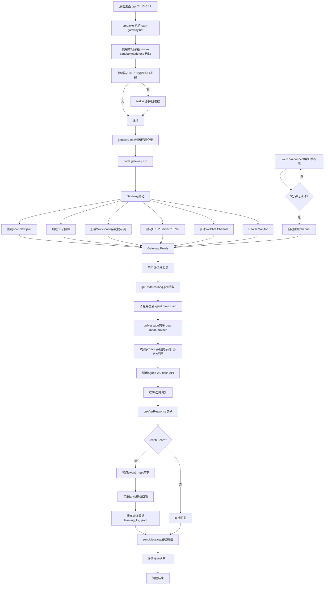

# OpenClaw 完整流程图

```mermaid
flowchart TD
    A[点击桌面 菡-v24.13.0.lnk] --> B[cmd.exe 执行 start-gateway.bat]
    B --> C[使用本地沙箱 .node-sandbox/node.exe 启动]
    C --> D[检测端口18789是否有旧进程]
    D -->|有| E[taskkill杀掉旧进程]
    D -->|无| F[继续]
    E --> F
    F --> G[gateway.cmd设置环境变量]
    G --> H[node gateway run]
    H --> I[Gateway启动]
    I --> I1[加载openclaw.json]
    I --> I2[加载32个插件]
    I --> I3[加载Workspace系统提示词]
    I --> I4[启动HTTP Server :18789]
    I --> I5[启动WeChat Channel]
    I --> I6[Health Monitor]
    I1 & I2 & I3 & I4 & I5 & I6 --> J[Gateway Ready]
    J --> K[用户微信发消息]
    K --> L[getUpdates long-poll接收]
    L --> M[消息路由到agent:main:main]
    M --> N[onMessage钩子 dual-model-trainer]
    N --> O[构建prompt:系统提示词+历史+问题]
    O --> P[调用agnes-2.0-flash API]
    P --> Q[模型返回回复]
    Q --> R[onAfterResponse钩子]
    R --> S{Teach-Learn?}
    S -->|是| T[老师qwen3-max示范]
    T --> U[学生jarvis模仿口吻]
    U --> V[保存训练数据learning_log.jsonl]
    S -->|否| W[直接回复]
    V & W --> X[sendMessage发往微信]
    X --> Y[微信推送给用户]
    Y --> Z[流程结束]
    AA[weixin-reconnect每30秒检测] --> BB{3分钟无活动?}
    BB -->|是| CC[自动重启channel]
    BB -->|否| AA
    CC --> J
```
